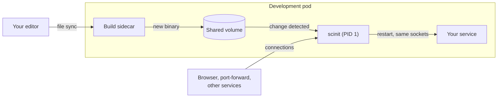

# scinit

A small init system for containers, written in Rust, built to make remote development environments feel local. scinit runs as the container's PID 1 and starts your program as its one child. It does what any container init has to: forwarding signals, shutting down gracefully, reaping zombies, and exiting with the child's status. On top of that, it restarts your program when a new build of it lands in the container (live reload), and it keeps the program's listening sockets open across those restarts (socket inheritance), so nothing connected to it notices the swap.

## Why scinit

In an organization with many services, running everything on a laptop is a hassle and often impossible: there are too many services, too much data, and too many dependencies on the real infrastructure. So development moves to a remote environment, a Docker host or a Kubernetes cluster, and the existing tools mostly take one of two routes. Some keep your service running on your laptop and route network traffic between it and the cluster, as [Telepresence](https://www.telepresence.io) does. Others, such as [Garden](https://garden.io) and [Tilt](https://tilt.dev), are built around a deploy loop: a change rebuilds the image and re-applies the manifests, and the cluster replaces the pods.

scinit is part of a different approach. The service runs in the cluster, deployed once, and stays deployed: no traffic is routed to your laptop, and a code change doesn't touch the manifests or recreate the pod. Only the code moves. Your edits are synchronized into the running development pod (with [Mutagen](https://mutagen.io) or something simpler), a sidecar container recompiles the program and writes the new binary into a volume it shares with the application container, and scinit, running the application, notices the new binary and swaps the running process for it in place.



Restarting a server normally means a window in which nothing listens on its port, and every client in that window, from a browser to a `kubectl port-forward` to another service in the cluster, gets "connection refused". With `--ports`, scinit binds the listening sockets itself and hands the same sockets to every new process, so connections made during a restart wait in the socket's backlog and are answered by the new build. From the outside, the service never went away.

Underneath, scinit is still a proper init. The kernel treats PID 1 differently from every other process: a signal PID 1 has no handler for is simply dropped, so a server run directly as the container's command often ignores `docker stop` until it is killed with SIGKILL, and orphaned processes are re-parented to PID 1 and stay zombies unless it collects them. scinit handles the signals, forwards them to your program's process group, escalates to SIGKILL after a timeout, reaps orphans, and exits with your program's exit code, the same job [tini](https://github.com/krallin/tini) and [dumb-init](https://github.com/Yelp/dumb-init) do. Without live reload, a crash still ends the container, so the same image and entrypoint work in production.

## Examples

As a container entrypoint, with your program as the command:

```dockerfile
COPY scinit /usr/local/bin/scinit
ENTRYPOINT ["/usr/local/bin/scinit", "--"]
CMD ["my-server", "--config", "/etc/my-server.toml"]
```

Running a program directly. The `--` ends scinit's own options, so everything after it is the command and its arguments, passed through unchanged:

```bash
scinit -- my-server --config /etc/my-server.toml
```

Restarting the program whenever a file in `./config` changes:

```bash
scinit --live-reload --watch-path ./config -- my-server
```

Binding port 8080 on every interface and passing it to the program as file descriptor 3, with `LISTEN_FDS=1` and `LISTEN_PID` set as systemd does:

```bash
scinit --ports 8080 --bind-addr 0.0.0.0 -- my-server
```

## Documentation

- [Documentation index](docs/README.md), with a suggested reading order
- [Getting started](docs/getting-started.md): build scinit, run it, put it in a container
- [Why a container needs an init](docs/guides/why-an-init.md)
- [Signals and shutdown](docs/guides/signals-and-shutdown.md)
- [Exit codes](docs/guides/exit-codes.md)
- [Zombie reaping](docs/guides/zombie-reaping.md)
- [Process isolation](docs/guides/process-isolation.md): process groups, the terminal, file descriptors
- [Live reload](docs/guides/live-reload.md)
- [Socket activation](docs/guides/socket-activation.md)
- [Logging](docs/guides/logging.md)
- [Command-line reference](docs/reference/cli.md): every flag, environment variable and exit code
- [Development](docs/development.md): building and testing scinit itself

Known issues and planned work are tracked in [GitHub issues](https://github.com/divoxx/scinit/issues).

## Building

scinit has no prebuilt binaries yet. Build it with `cargo build --release`, which produces `target/release/scinit`. Running the test suite and the Linux container runner are covered in [docs/development.md](docs/development.md).

scinit targets Linux containers. macOS is supported for development, and the test suite runs on both; the behavior that is specific to PID 1 only applies on Linux.

## License

Licensed under the [Apache License, Version 2.0](LICENSE).
