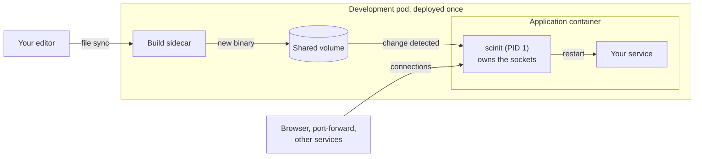

# scinit

A container init, written in Rust, for when tini and dumb-init aren't quite enough. scinit runs as the container's PID 1, starts your program as its one child, and does everything a container init has to: it forwards signals, reaps zombies and exits with your program's status. On top of that it bounds every shutdown with a SIGKILL deadline, can restart your program when a new build of it lands in the container (live reload), and can hold your program's listening sockets so they stay open across those restarts (socket inheritance, using the systemd socket-activation protocol).

## Why a container needs an init

The first process in a container runs as PID 1, and the kernel treats PID 1 differently from every other process. A signal PID 1 has no handler for is simply dropped, so a server run directly as the container's command often ignores `docker stop` until the runtime gives up and kills it with SIGKILL, skipping any cleanup. PID 1 also inherits every orphaned process in the container, and unless it collects their exit status they stay behind as zombies. [tini](https://github.com/krallin/tini) and [dumb-init](https://github.com/Yelp/dumb-init) exist to fill that role, and scinit fills it too. [Why a container needs an init](docs/guides/why-an-init.md) covers the problem in depth.

## What scinit adds

| | tini | dumb-init | scinit |
|---|---|---|---|
| Forwards signals to your program | yes | yes | yes, to its whole process group |
| Reaps zombies | yes | yes | yes |
| Exits with your program's status | yes | yes | yes |
| Escalates to SIGKILL after a shutdown timeout | no | no | yes |
| Restarts your program when its build changes | no | no | yes, with `--live-reload` |
| Holds listening sockets across restarts | no | no | yes, with `--ports` |

Each addition, and most of scinit's design decisions, come from a concrete problem.

A plain init forwards SIGTERM and then waits for as long as your program takes. If the program hangs, the shutdown only ends when the runtime kills the whole container, and nothing records why. scinit gives every shutdown a deadline (`--graceful-timeout-secs`), sends SIGKILL to the program's process group when it passes, and logs that it did. It signals the whole process group rather than one process, so helpers and workers your program started shut down with it. See [signals and shutdown](docs/guides/signals-and-shutdown.md).

Live reload lives in the init because that is the only place it can live cleanly. A file watcher that restarts your program inside a container either has to be PID 1 itself, and then it needs everything an init does, or has to be supervised by one. In scinit it is one more event in the same loop that handles signals and child exits. Restarts only ever come from a file change, never from a crash: when your program exits on its own, scinit exits with its status, so a crash is visible to the orchestrator instead of being hidden by a restart loop. See [live reload](docs/guides/live-reload.md).

Socket inheritance exists because restarting a server normally leaves a window in which nothing listens on its port and clients get "connection refused". scinit binds the sockets once, before starting your program, keeps them for its whole lifetime and passes the same sockets to every process it starts, so a connection made during a restart waits in the socket's backlog and is answered by the new process. It uses the systemd protocol (`LISTEN_FDS`, `LISTEN_PID`, file descriptors 3 onwards) rather than inventing one, so programs and libraries that already support systemd socket activation work unchanged. See [socket activation](docs/guides/socket-activation.md).

Smaller decisions follow the same reasoning. scinit writes its own logs to stderr only, because stdout belongs to your program, and filters them with `SCINIT_LOG` rather than `RUST_LOG`, because `RUST_LOG` in the container's environment is meant for your program. Your program starts in its own process group with a clean signal mask and no file descriptors other than stdio and the sockets it was given, so nothing scinit itself inherited leaks into it. See [logging](docs/guides/logging.md) and [process isolation](docs/guides/process-isolation.md).

## Use cases

**As the init of production containers.** Use scinit anywhere you would use tini or dumb-init. You get the same guarantees plus a bounded, logged shutdown. Without `--live-reload`, scinit never restarts anything: a crash ends the container, and the orchestrator decides what happens next.

**Remote development environments.** This is the use case live reload and socket inheritance were designed for. When a system has too many services to run on a laptop, development moves to a Docker host or Kubernetes cluster. Rather than routing traffic to your laptop, as [Telepresence](https://www.telepresence.io) does, or rebuilding images and re-applying manifests on every change, the deploy loop [Garden](https://garden.io) and [Tilt](https://tilt.dev) are built around, the service stays deployed and only the code moves. Your edits are synced into the running pod, a build sidecar recompiles the program into a shared volume, and scinit swaps the running process for the new build in place while its sockets stay open, so your browser, a `kubectl port-forward` and other services in the cluster never see it go away.



The same image and entrypoint then go to production with the live-reload flags dropped. [Remote development environments](docs/guides/remote-development.md) walks through the setup and what each piece is responsible for.

**Local development in containers.** The same mechanism works on a single machine: with Docker Compose or a plain `docker run`, mount your build output into the container and let scinit restart the program whenever you rebuild, keeping its ports open in between.

**Socket-activated services in containers.** Programs written to receive their listening sockets from systemd can run in a container without changes: scinit binds the ports and hands them over the same way systemd would.

## Examples

As a container entrypoint, with your program as the command:

```dockerfile
COPY scinit /usr/local/bin/scinit
ENTRYPOINT ["/usr/local/bin/scinit", "--"]
CMD ["my-server", "--config", "/etc/my-server.toml"]
```

Running a program directly. The `--` ends scinit's own options, so everything after it is the command and its arguments, passed through unchanged:

```bash
scinit -- my-server --config /etc/my-server.toml
```

Restarting the program whenever a file in `./config` changes:

```bash
scinit --live-reload --watch-path ./config -- my-server
```

Binding port 8080 on every interface and passing it to the program as file descriptor 3, with `LISTEN_FDS=1` and `LISTEN_PID` set as systemd does:

```bash
scinit --ports 8080 --bind-addr 0.0.0.0 -- my-server
```

## Documentation

- [Documentation index](docs/README.md), with a suggested reading order
- [Getting started](docs/getting-started.md): build scinit, run it, put it in a container
- [Why a container needs an init](docs/guides/why-an-init.md)
- [Signals and shutdown](docs/guides/signals-and-shutdown.md)
- [Exit codes](docs/guides/exit-codes.md)
- [Zombie reaping](docs/guides/zombie-reaping.md)
- [Process isolation](docs/guides/process-isolation.md): process groups, the terminal, file descriptors
- [Live reload](docs/guides/live-reload.md)
- [Remote development environments](docs/guides/remote-development.md)
- [Socket activation](docs/guides/socket-activation.md)
- [Logging](docs/guides/logging.md)
- [Command-line reference](docs/reference/cli.md): every flag, environment variable and exit code
- [Development](docs/development.md): building and testing scinit itself

Known issues and planned work are tracked in [GitHub issues](https://github.com/divoxx/scinit/issues).

## Building

scinit has no prebuilt binaries yet. Build it with `cargo build --release`, which produces `target/release/scinit`. Running the test suite and the Linux container runner are covered in [docs/development.md](docs/development.md).

scinit targets Linux containers. macOS is supported for development, and the test suite runs on both; the behavior that is specific to PID 1 only applies on Linux.

## License

Licensed under the [Apache License, Version 2.0](LICENSE).
