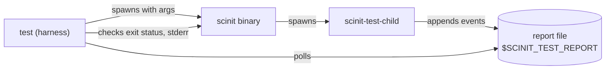

# Development

This page is for working on scinit itself: building it, running the test suite, and understanding how the tests are put together. If you only want to use scinit, [Getting started](getting-started.md) is the better place to begin.

## Building

scinit is an ordinary Cargo project with no build steps beyond Cargo's.

```bash
cargo build              # debug build: target/debug/scinit
cargo build --release    # release build: target/release/scinit
```

Both builds also produce a second binary, `scinit-test-child`, which the integration tests use as scinit's child. It is never installed or shipped; it exists only for testing. The repository's `.cargo/config.toml` adds a compiler flag (`--cfg tokio_unstable`) to every build, so build from the repository root to pick it up.

Before sending a change, format the code and run Clippy the way CI does, with warnings treated as errors:

```bash
cargo fmt
cargo clippy --all-targets -- -D warnings
```

CI runs `cargo fmt --check` and fails if formatting would change any file.

This also enforces a crate-level rule: scinit may not use `print!`, `eprintln!` and friends. Everything it says goes through `tracing`, so that every line has the same format and obeys `SCINIT_LOG` (see [Logging](guides/logging.md)).

## Why the tests look the way they do

An init is hard to test from the inside. What matters is what its child experiences (which signals arrive, which environment and file descriptors it gets, whether it ends up in its own process group) and what the outside world sees (scinit's exit code and output). Unit tests of individual functions can't show any of that. So, apart from the unit tests in each module, the suite runs the real `scinit` binary with a real child and asks the child what happened.



### The fixture child

The child is `tests/fixtures/test_child.rs`, built as `scinit-test-child`. It is a small program with a few subcommands, each modeled on something a real child might do, and it reports what it observes by appending one line per event to the file named in `$SCINIT_TEST_REPORT`. Each line has the form `<name> pid=<pid> t=<microseconds> key=value ...`, and it also echoes every event to stderr prefixed with `[test-child]`, which helps when you run it by hand.

`run` reports `started` and then waits, recording each signal it receives; flags choose which signals it traps, ignores or exits on, and `--grandchild` makes it fork a second process into the same group. `exit <code>` exits with the given code, and `kill-self <SIG>` kills itself with a signal, which together cover the exit-code paths. `dump` records the child's argv, the `LISTEN_*` variables (plus any others named with `--env`), its open file descriptors, its signal mask, whether SIGTTIN, SIGTTOU, SIGINT and SIGQUIT are ignored, whether its group holds the terminal's foreground, and its working directory. `listen` finds the sockets it inherited, accepts on each one, and answers every connection with `pid=<pid> fd=<n> port=<port>`, so a test can tell which process served it, which is how the socket activation and live-reload tests check that no connection is dropped across a restart. `spawn-orphan` creates an orphaned process and checks whether it gets reaped, which only means something when scinit is PID 1.

The fixture is also handy outside the tests, for example to write a reproduction for an issue or to see what scinit hands to a child:

```
$ cargo build
$ SCINIT_TEST_REPORT=/tmp/report.log target/debug/scinit --ports 18090 -- target/debug/scinit-test-child dump --then-exit
[test-child] started pid=95285 t=1791447112917856 role=child pgid=95285 ppid=95284
[test-child] arg pid=95285 t=1791447112918083 index=0 value=target/debug/scinit-test-child
[test-child] arg pid=95285 t=1791447112918114 index=1 value=dump
[test-child] arg pid=95285 t=1791447112918140 index=2 value=--then-exit
[test-child] env pid=95285 t=1791447112918175 key=LISTEN_FDS value=1
[test-child] env pid=95285 t=1791447112918202 key=LISTEN_PID value=95285
[test-child] fds pid=95285 t=1791447112918226 open=0,1,2,3 sockets=3
[test-child] sigmask pid=95285 t=1791447112918267 blocked=
[test-child] sigdisp pid=95285 t=1791447112918294 sig=TTIN ignored=false
[test-child] sigdisp pid=95285 t=1791447112918318 sig=TTOU ignored=false
[test-child] sigdisp pid=95285 t=1791447112918329 sig=INT ignored=false
[test-child] sigdisp pid=95285 t=1791447112918340 sig=QUIT ignored=false
[test-child] tty pid=95285 t=1791447112918349 none
[test-child] cwd pid=95285 t=1791447112918358 value=/home/you/scinit
[test-child] dump-done pid=95285 t=1791447112918381
[test-child] exit pid=95285 t=1791447112918403 code=0
```

The child leads its own process group (`pgid` equals `pid`), `LISTEN_PID` is its own pid, it has only stdio and the one socket at fd 3, and its signal mask is empty.

### The harness

`tests/integration/harness.rs` wraps all of this in a builder. `Scinit::builder()` configures the scinit command line and the fixture subcommand, starts scinit with nothing open but stdio (so stray file descriptors from the test process can't leak into what the child reports), captures its stdout and stderr, and gives each test its own report file. Shortcuts such as `start`, `spawn_dump`, `ports` and `watch` cover the common setups.

The tests never sleep for a fixed time and hope something has happened. They poll the report file instead, with helpers such as `wait_for`, `wait_for_nth_match`, `wait_exit` and `poll_until`, and they assert with helpers such as `assert_exit_code`, `assert_start_count` and `assert_reply_from` whose failure messages include scinit's output and the child's events. This keeps the suite fast when the machine is idle and reliable when it is loaded. Every test is a plain `#[test]`, without a tokio runtime of its own, and the harness kills scinit and the process group of every child it started when the test ends, even if it failed halfway through a live-reload restart.

### Scenarios

The tests themselves live in `tests/integration/scenarios/`, one module per area: `cli` for argument handling, `exit_codes`, `signals`, `sockets`, `live_reload`, and `smoke` for the harness itself. A Linux-only `linux` module checks what only Linux can show, reading signal masks from `/proc` and running scinit as PID 1 of a new PID namespace (with `unshare`) to test signal handling and orphan reaping as an init. All of them compile into one test target, `integration_test`.

## Running the tests

```bash
cargo test                                      # unit and integration tests
cargo test -- --nocapture                       # with output
cargo test --test integration_test              # the integration suite only
cargo test --test integration_test signals::    # one scenario module
```

On macOS this runs everything except the `linux` module. On Linux, the PID 1 tests need permission to create a PID namespace; when the host doesn't allow that, they log why and skip rather than fail.

### On Linux, in podman

To run the whole suite on Linux, including the PID 1 tests, from any machine with podman (on macOS, inside a podman machine), use the runner script:

```bash
scripts/test-linux.sh
scripts/test-linux.sh --test integration_test sockets::   # arguments go to cargo test
```

It builds a test image from `tests/container/Containerfile`, a Debian-based Rust image with `procps` and `util-linux` added, and runs `cargo test` inside it in rootless podman. The Cargo registry and target directory are kept in build cache mounts, so after the first run only what changed recompiles. The container gets the `SYS_ADMIN` capability (scoped to the rootless user namespace), an unmasked `/proc` and no SELinux label, which is what `unshare --pid --mount-proc` needs to give scinit a fresh PID namespace. The script also sets `SCINIT_REQUIRE_PID1=1`, which turns the PID 1 tests' skip into a failure, so a misconfigured container can't hide them. `SCINIT_TEST_IMAGE` changes the image tag and `SCINIT_PODMAN_RUN_ARGS` adds flags to `podman run`.

## Continuous integration

`.github/workflows/ci.yml` runs on every pull request and on every push to `main`. It checks formatting with `cargo fmt --check`, runs Clippy with `-D warnings` on both macOS and Linux, since some code only compiles on one of them, then `cargo test` on a macOS runner and `scripts/test-linux.sh` on an Ubuntu runner. The Linux job therefore runs exactly what you run locally with the script, PID 1 tests included.

## Known issues

Bugs, limitations and planned features are tracked in [GitHub issues](https://github.com/divoxx/scinit/issues). A good issue describes what happens and where in the code, gives a reproduction (the fixture child above is often the easiest way to write one), and, once it has been discussed, records the agreed fix and its priority.

When the suite exposes a bug that isn't fixed yet, its failing test stays in the suite but is marked `#[ignore = "bug: #<issue>"]`, so the default run stays green while the test remains easy to find and run:

```bash
grep -rn 'bug: #42' tests/    # the tests for issue #42
cargo test -- --ignored       # only the known-bug tests, expected to fail
```

When you fix a bug, remove the `#[ignore]` from its tests, reference the issue in the pull request (`Fixes #42`), and update any documentation that describes the old behavior.
