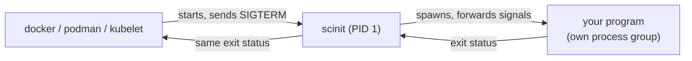

# Getting started

This guide takes you from a source checkout to scinit running as the init of a container image. Along the way it shows what scinit does when you stop it, and how to use it as a development loop that restarts your program when you edit it. Each step is short, and the [guides](README.md) cover every topic in depth afterwards.

In a container, scinit is the process the runtime starts, so it runs as PID 1. It starts your program as its only child and stays in between for the program's whole life: signals from the runtime go through scinit to your program, and your program's exit status comes back through scinit to the runtime.



## Build scinit

There are no prebuilt binaries and no crates.io release yet, so you build scinit from source. You need a Rust toolchain (the stable channel through [rustup](https://rustup.rs) works) and a checkout of this repository. Then, from the repository root:

```bash
cargo build --release
```

The binary is `target/release/scinit`. It is a single executable with no runtime files, so you can copy it wherever you like. The examples below assume it is on your `PATH`, or that you replace `scinit` with the path to it.

scinit is built for Linux containers, and it also runs on macOS so that you can develop with it locally. Everything in this guide works on both, except that a program run outside a container doesn't start as PID 1, which only changes what happens to orphaned processes (see [Zombie reaping](guides/zombie-reaping.md)).

## A first run

The smallest useful thing scinit can do is run one command and get out of the way:

```
$ scinit -- echo hello
hello
$ echo $?
0
```

The `--` separates scinit's own options from the command it should run, so everything after it reaches the child unchanged. Always write it: without it, scinit still reads its own flags right after the command name, and `scinit echo --help` prints scinit's help instead of running `echo --help`. The [command-line reference](reference/cli.md#synopsis) has the details.

scinit printed nothing of its own. Its log messages go to stderr only, and the default level shows errors and nothing else, so stdout carries exactly what your program writes. When the command exits, scinit exits with the same code:

```
$ scinit -- sh -c 'exit 3'
$ echo $?
3
$ scinit -- no-such-command
ERROR scinit: Failed to spawn process 'no-such-command': No such file or directory (os error 2)
$ echo $?
1
```

## Put it in a container image

In an image, scinit becomes the `ENTRYPOINT` and your program the `CMD`. Because the entrypoint ends with `--`, whatever command you pass to `docker run` replaces only the `CMD` and still runs under scinit.

The Dockerfile below builds scinit in a Rust image and copies only the binary into the runtime image. Save it in the root of the scinit checkout (or adapt the `COPY` to wherever the source lives) and build it from there.

```dockerfile
FROM docker.io/library/rust:1-slim-bookworm AS scinit
WORKDIR /src
COPY . .
RUN cargo build --release --bin scinit

FROM docker.io/library/debian:bookworm-slim
COPY --from=scinit /src/target/release/scinit /usr/local/bin/scinit
ENTRYPOINT ["/usr/local/bin/scinit", "--"]
CMD ["sleep", "infinity"]
```

`COPY . .` also brings in the repository's `.cargo/config.toml`, so the image is built with the same settings as a local `cargo build`. Leave the local `target/` directory out of the build context (with a `.dockerignore` containing `target`), since it is large and the build doesn't use it.

Both stages use Debian bookworm on purpose. A binary built this way is linked against the build image's C library (glibc), and it only runs on a runtime image with the same C library at the same version or newer. Copying it into an Alpine image, which uses musl instead of glibc, fails with a confusing "No such file or directory" (or `not found` from a shell) even though the file is there: what is missing is glibc's dynamic loader, not scinit. If your runtime image is Alpine, scinit has to be built against musl as well, for example in an Alpine-based Rust build stage. The simplest choice is a Debian slim runtime that matches the build stage, as above.

Build the image and run a command in it:

```
$ docker build -t scinit-demo .
$ docker run --rm scinit-demo echo hello from the container
hello from the container
```

## Watch a graceful shutdown

The point of an init in a container is what happens when the container is stopped. Run the image in the background with scinit's logging raised to `info`, so it reports each step, then stop it:

```
$ docker run -d --name demo -e SCINIT_LOG=info scinit-demo
$ docker stop demo
$ docker logs demo
 INFO scinit: scinit starting
 INFO scinit: init system started, managing subprocess: sleep
 INFO scinit::process_manager: Spawning process: sleep ["infinity"]
 INFO scinit::process_manager: Process spawned with PID: 9
 INFO scinit: received termination signal SIGTERM, initiating graceful shutdown
 INFO scinit: Termination signal SIGTERM received, forwarding to child process (timeout: 30s)
 INFO scinit::process_manager: Initiating graceful shutdown of process 9 with SIGTERM
 INFO scinit::process_manager: Process exited gracefully
 INFO scinit: scinit exiting due to termination signal SIGTERM
 INFO scinit: scinit exiting with code 143
$ docker inspect demo --format '{{.State.ExitCode}}'
143
```

The stop returned immediately. The runtime sent SIGTERM to scinit, scinit forwarded it to the process group of `sleep`, `sleep` died from it, and scinit exited with 143, which is 128 plus SIGTERM's number 15: the code a shell reports for a process killed by SIGTERM. Run the same image with `--entrypoint sleep` so that `sleep` itself is PID 1, and `docker stop` hangs for its full 10 second timeout before falling back to SIGKILL, because PID 1 gets no default action for SIGTERM. [Why a container needs an init](guides/why-an-init.md) explains why.

If your program handles SIGTERM itself and takes a while to finish, scinit waits for it, up to `--graceful-timeout-secs` (30 seconds by default), before it sends SIGKILL to the whole process group. The runtime has a stop timeout of its own, 10 seconds for Docker and podman, and whichever runs out first wins. Under Docker's default, set scinit's a few seconds lower, for example `--graceful-timeout-secs 8`, so that scinit's escalation is the one that happens. [Signals and shutdown](guides/signals-and-shutdown.md#choosing-the-graceful-timeout) explains the trade-off, including Kubernetes.

The same applies to Ctrl-C in a terminal. When scinit runs attached to a terminal, it makes your program's process group the terminal's foreground group, so Ctrl-C sends SIGINT straight to your program, and scinit exits with your program's status (130 for a program killed by SIGINT).

## A first live-reload loop

scinit can also restart your program when its files change. This is what it was built for: in a remote development environment, a new build of your service lands in the container and scinit swaps the running process for it (the [README](../README.md) shows the full setup). Locally, the same mechanism makes a small development loop. Create a script that stands in for a server: it prints its version and then waits.

```bash
mkdir scinit-demo && cd scinit-demo
cat > app.sh <<'EOF'
#!/bin/sh
echo "app started, version 1"
exec sleep 3600
EOF
chmod +x app.sh
```

Run it under scinit with `--live-reload`, watching the directory the script is in:

```bash
SCINIT_LOG=info scinit --live-reload --watch-path . -- ./app.sh
```

Now edit `app.sh` in another terminal or in your editor, changing `version 1` to `version 2`, and save. Half a second after the last change (the `--debounce-ms` default of 500), scinit stops the old process, waits for the `--restart-delay-ms` pause (1 second by default), and starts the new one. This is the real output, with the pids and the directory being whatever they are on your machine:

```
 INFO scinit: scinit starting
 INFO scinit: init system started, managing subprocess: ./app.sh
 INFO scinit::file_watcher: Started watching path: "."
 INFO scinit: File watching started for live-reload
 INFO scinit::process_manager: Spawning process: ./app.sh []
 INFO scinit::process_manager: Process spawned with PID: 94754
app started, version 1
 INFO scinit: File changed: "/home/you/scinit-demo/app.sh", triggering restart
 INFO scinit::process_manager: Restarting process due to file change
 INFO scinit::process_manager: Initiating graceful shutdown of process 94754 with SIGTERM
 INFO scinit::process_manager: Process exited gracefully
 INFO scinit::process_manager: Spawning process: ./app.sh []
 INFO scinit::process_manager: Process spawned with PID: 94860
app started, version 2
```

Press Ctrl-C to end it. Watching the directory rather than `app.sh` itself matters on Linux: many editors save by writing a new file and renaming it over the old one, and a watch on a single file is lost when that happens. Without `--watch-path`, scinit watches the command's executable, which is a single file, so pass the directory your build writes to instead. [Live reload](guides/live-reload.md) explains both.

Two rules from the container world still apply in this mode. Only file changes cause a restart: if the program exits or crashes on its own, scinit exits with its status instead of starting it again. And a restart briefly leaves nothing running, so a server would refuse connections in that window, unless scinit holds its listening socket. That is what `--ports` is for:

```bash
scinit --live-reload --watch-path ./bin --ports 8080 -- ./bin/my-server
```

With it, scinit binds port 8080 once and hands the same socket to every new process as file descriptor 3. Connections that arrive during a restart wait in the socket's queue until the new process accepts them. Your program has to pick up the socket instead of binding the port itself, as described in [Socket activation](guides/socket-activation.md).

## Next steps

If you are putting scinit into production images, read [Why a container needs an init](guides/why-an-init.md), [Signals and shutdown](guides/signals-and-shutdown.md) and [Exit codes](guides/exit-codes.md) next. If you are setting up a development environment, continue with [Live reload](guides/live-reload.md) and [Socket activation](guides/socket-activation.md). [Logging](guides/logging.md) helps when something doesn't behave as you expect, and the [command-line reference](reference/cli.md) lists every option. The [documentation index](README.md) has the full list.
