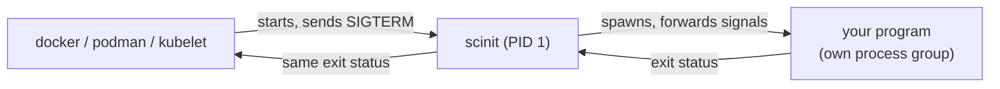

# Getting started

This guide takes you from a source checkout to scinit running as the init of a container image. Along the way it shows what scinit does when you stop it, and how to use it as a development loop that restarts your program when you edit it. Each step is short, and the [guides](README.md) cover every topic in depth afterwards.

In a container, scinit is the process the runtime starts, so it runs as PID 1. It starts your program as its only child and stays in between for the program's whole life: signals from the runtime go through scinit to your program, and your program's exit status comes back through scinit to the runtime.



## Build scinit

There are no prebuilt binaries and no crates.io release yet, so you build scinit from source. You need a Rust toolchain (the stable channel through [rustup](https://rustup.rs) works) and a checkout of this repository. Then, from the repository root:

```bash
cargo build --release
```

The binary is `target/release/scinit`. It is a single executable with no runtime files, so you can copy it wherever you like. The examples below assume it is on your `PATH`, or that you replace `scinit` with the path to it.

scinit is built for Linux containers, and it also runs on macOS so that you can develop with it locally. Everything in this guide works on both, except that a program run outside a container doesn't start as PID 1, which only changes what happens to orphaned processes (see [Zombie reaping](guides/zombie-reaping.md)).

## A first run

The simplest use of scinit is to run one command and exit with its status:

```
$ scinit -- echo hello
hello
$ echo $?
0
```

The `--` separates scinit's own options from the command it should run. It is optional: scinit stops reading its own options at the command name, so everything from there on reaches the child unchanged either way. Writing it makes the split easy to see. The [command-line reference](reference/cli.md#synopsis) has the details.

scinit printed nothing of its own. Its log messages go to stderr only, and the default level shows errors and nothing else, so stdout carries exactly what your program writes. When the command exits, scinit exits with the same code:

```
$ scinit -- sh -c 'exit 3'
$ echo $?
3
$ scinit -- no-such-command
[fail]  scinit: Failed to spawn process 'no-such-command': No such file or directory (os error 2)
$ echo $?
1
```

### In a container

In a container image, scinit is the `ENTRYPOINT`. The rest of this guide uses one image for every example, so its entrypoint is scinit alone, and the arguments you pass to `docker run` after the image name are scinit's arguments: its own options, then `--`, then the command. The `CMD` supplies a default command for when you pass nothing.

The Dockerfile below builds scinit in a Rust image and copies only the binary into the runtime image. Save it in the root of the scinit checkout (or adapt the `COPY` to wherever the source lives) and build it from there.

```dockerfile
FROM docker.io/library/rust:1-slim-bookworm AS scinit
WORKDIR /src
COPY . .
RUN cargo build --release --bin scinit

FROM docker.io/library/debian:bookworm-slim
COPY --from=scinit /src/target/release/scinit /usr/local/bin/scinit
ENTRYPOINT ["/usr/local/bin/scinit"]
CMD ["--", "sleep", "infinity"]
```

`COPY . .` also brings in the repository's `.cargo/config.toml`, so the image is built with the same settings as a local `cargo build`. Leave the local `target/` directory out of the build context (with a `.dockerignore` containing `target`), since it is large and the build doesn't use it.

Both stages use Debian bookworm on purpose. A binary built this way is linked against the build image's C library (glibc), and it only runs on a runtime image with the same C library at the same version or newer. Copying it into an Alpine image, which uses musl instead of glibc, fails with a confusing "No such file or directory" (or `not found` from a shell) even though the file is there: what is missing is glibc's dynamic loader, not scinit. If your runtime image is Alpine, scinit has to be built against musl as well, for example in an Alpine-based Rust build stage. The simplest choice is a Debian slim runtime that matches the build stage, as above.

Build the image and run the same first command in it:

```
$ docker build -t scinit-demo .
$ docker run --rm scinit-demo -- echo hello from the container
hello from the container
```

An image for your own program usually fixes scinit's options and the `--` in the entrypoint instead, for example `ENTRYPOINT ["/usr/local/bin/scinit", "--graceful-timeout-secs", "8", "--"]` with your program as the `CMD`, so `docker run` arguments only replace the program. Keeping them separate here lets the following sections pass different options to the same image.

## Watch a graceful shutdown

The point of an init in a container is what happens when the container is stopped. Run the image in the background with its default command (`sleep infinity`) and scinit's logging raised to `info`, so it reports each step, then stop it:

```
$ docker run -d --name demo -e SCINIT_LOG=info scinit-demo
$ docker stop demo
$ docker logs demo
[info]  scinit: scinit starting
[info]  scinit: init system started, managing subprocess: sleep
[info]  scinit: Spawning process: sleep ["infinity"]
  [ok]  scinit: Process spawned with PID: 9
[info]  scinit: received termination signal SIGTERM, initiating graceful shutdown
[info]  scinit: Termination signal SIGTERM received, forwarding to child process (timeout: 30s)
[info]  scinit: Initiating graceful shutdown of process 9 with SIGTERM
[info]  scinit: Process exited gracefully
[info]  scinit: scinit exiting due to termination signal SIGTERM
[info]  scinit: scinit exiting with code 143
$ docker inspect demo --format '{{.State.ExitCode}}'
143
```

The stop returned immediately. The runtime sent SIGTERM to scinit, scinit forwarded it to the process group of `sleep`, `sleep` died from it, and scinit exited with 143, which is 128 plus SIGTERM's number 15: the code a shell reports for a process killed by SIGTERM. Run the same image with `--entrypoint sleep` so that `sleep` itself is PID 1, and `docker stop` hangs for its full 10 second timeout before falling back to SIGKILL, because PID 1 gets no default action for SIGTERM. [Why a container needs an init](guides/why-an-init.md) explains why.

If your program handles SIGTERM itself and takes a while to finish, scinit waits for it, up to `--graceful-timeout-secs` (30 seconds by default), before it sends SIGKILL to the whole process group. The runtime has a stop timeout of its own, 10 seconds for Docker and podman, and whichever runs out first wins. Under Docker's default, set scinit's a few seconds lower, for example `--graceful-timeout-secs 8`, so that scinit's escalation is the one that happens. [Signals and shutdown](guides/signals-and-shutdown.md#choosing-the-graceful-timeout) explains the trade-off, including Kubernetes.

The same applies to Ctrl-C in a terminal. When scinit runs attached to a terminal, it makes your program's process group the terminal's foreground group, so Ctrl-C sends SIGINT straight to your program, and scinit exits with your program's status (130 for a program killed by SIGINT).

## A first live-reload loop

scinit can also restart your program when its files change. This is what it was built for: in a remote development environment, a new build of your service can be written into the container, and scinit then swaps the running process for it (the [README](../README.md) shows the full setup). The same image from above is enough to try it, with a directory from your machine mounted into the container.

Create a directory with a script that stands in for a server: it prints its version and then waits.

```bash
mkdir app
cat > app/app.sh <<'EOF'
#!/bin/sh
echo "app started, version 1"
exec sleep 3600
EOF
chmod +x app/app.sh
```

Mount the directory into the container at `/app` and run the script under scinit with `--live-reload`, watching that directory:

```bash
docker run --rm -e SCINIT_LOG=info -v "$PWD/app:/app" scinit-demo \
  --live-reload --watch-path /app -- /app/app.sh
```

Now edit `app/app.sh` on your machine, changing `version 1` to `version 2`, and save. Half a second after the last change (the `--debounce-ms` default of 500), scinit stops the old process, waits for the `--restart-delay-ms` pause (1 second by default), and starts the new one. This is the real output from a Linux host:

```
[info]  scinit: scinit starting
[info]  scinit: init system started, managing subprocess: /app/app.sh
[info]  scinit: Started watching path: "/app"
  [ok]  scinit: File watching started for live-reload
[info]  scinit: Spawning process: /app/app.sh []
  [ok]  scinit: Process spawned with PID: 10
app started, version 1
[info]  scinit: File changed: "/app/app.sh", triggering restart
[info]  scinit: Restarting process due to file change
[info]  scinit: Initiating graceful shutdown of process 10 with SIGTERM
[info]  scinit: Process exited gracefully
[info]  scinit: Spawning process: /app/app.sh []
  [ok]  scinit: Process spawned with PID: 12
app started, version 2
```

Depending on how your editor saves, the `File changed` line can name a temporary file instead of `app.sh`. Press Ctrl-C to end it.

### scinit doesn't move files into the container

In this example, the bind mount is what brings the edit from your machine into the container. scinit only watches the file system inside the container and restarts your program when what it watches changes. It doesn't copy, synchronize or build anything, and it doesn't depend on how the changes arrive. A bind mount is the simplest way on one machine. In a remote environment, where your machine's directories can't be mounted, other tools can take that role: a file-sync tool such as [Mutagen](https://mutagen.io) can keep a directory in the container in step with your editor, and a build sidecar can compile the synchronized sources and write the binary into a volume the application container shares. As long as the result ends up in the path scinit watches, scinit restarts the program.

scinit is told about changes by the kernel's file notifications (inotify on Linux). Changes made inside the container, or on a Linux host through a bind mount, produce them. Container runtimes that run Linux in a virtual machine, as Docker Desktop and podman machine do on macOS and Windows, have to forward those notifications from the host into the virtual machine. Podman machine on macOS doesn't: in our test, an edit on the Mac changed the file inside the container, but scinit received no notification and didn't restart, while the same edit made inside the container (`docker exec`) restarted it at once. If you hit this, make the change inside the container, or use a sync tool that writes the files there.

### What to watch, and what live reload doesn't do

Watching the directory rather than `app.sh` itself matters on Linux: many editors save by writing a new file and renaming it over the old one, and a watch on a single file is lost when that happens. Without `--watch-path`, scinit watches the command's executable, which is a single file, so pass the directory your build writes to instead. [Live reload](guides/live-reload.md) explains both.

Two rules from the container world still apply in this mode. Only file changes cause a restart: if the program exits or crashes on its own, scinit exits with its status instead of starting it again. And a restart briefly leaves nothing running, so a server would refuse connections in that window, unless scinit holds its listening socket. That is what `--ports` is for, here with a server binary built into `./bin` on your machine:

```bash
docker run --rm -p 8080:8080 -v "$PWD/bin:/app/bin" scinit-demo \
  --live-reload --watch-path /app/bin --ports 8080 --bind-addr 0.0.0.0 -- /app/bin/my-server
```

With it, scinit binds port 8080 once and hands the same socket to every new process as file descriptor 3. Connections that arrive during a restart wait in the socket's queue until the new process accepts them. `--bind-addr 0.0.0.0` is needed in a container, because the default `127.0.0.1` isn't reachable through the published port. Your program has to pick up the socket instead of binding the port itself, as described in [Socket activation](guides/socket-activation.md).

## Next steps

If you are putting scinit into production images, read [Why a container needs an init](guides/why-an-init.md), [Signals and shutdown](guides/signals-and-shutdown.md) and [Exit codes](guides/exit-codes.md) next. If you are setting up a development environment, continue with [Live reload](guides/live-reload.md) and [Socket activation](guides/socket-activation.md). [Logging](guides/logging.md) helps when something doesn't behave as you expect, and the [command-line reference](reference/cli.md) lists every option. The [documentation index](README.md) has the full list.
