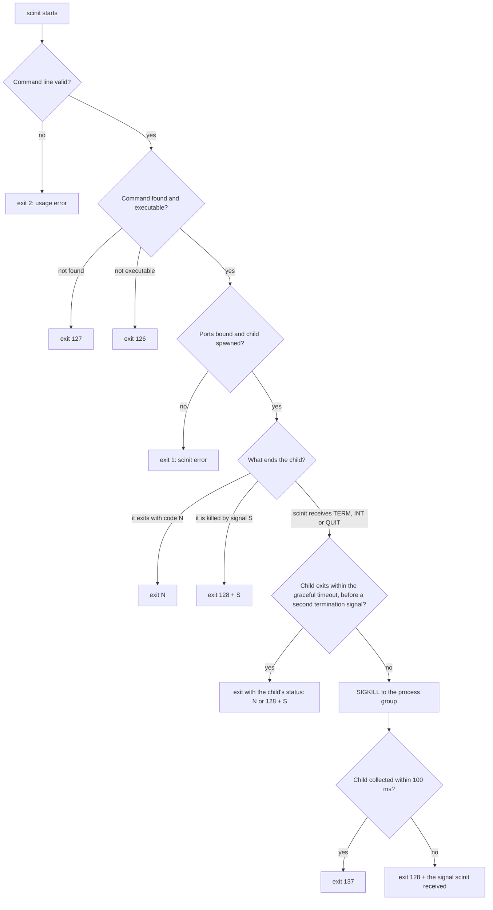

# Exit codes

A container's exit status is the exit status of its PID 1, and everything around the container reads it. Docker shows it in `docker ps -a` and uses it for `--restart on-failure`; Kubernetes records it as the container's termination reason, applies the pod's restart policy, and decides whether a Job succeeded. When scinit is PID 1, the number it exits with is the number all of these see, so it has to say what happened to your application, not what happened to scinit.

The rule is simple: scinit exits with the child's exit code, or with 128 plus the signal number if the child was killed by a signal, the same convention shells use for `$?`. A few cases fall outside that rule, and they are what this guide is about.



## The child exits on its own

When the child exits, scinit exits too, with the same code. A child that runs `exit 3` makes scinit exit 3, and a child that finishes successfully makes scinit exit 0. This is true with and without `--live-reload`: scinit never restarts a child that exited or crashed, because in a container a crash should end the container and let the orchestrator decide what to do next.

When the child is killed by a signal, there is no exit code to pass on, so scinit uses 128 plus the signal's number. A child killed by SIGKILL (9) gives 137, one that segfaults (SIGSEGV, 11) gives 139, and one killed by SIGTERM (15) gives 143.

```console
$ scinit -- sh -c 'exit 3'; echo "exit=$?"
exit=3
$ scinit -- sh -c 'kill -KILL $$'; echo "exit=$?"
exit=137
$ scinit -- sh -c 'kill -SEGV $$'; echo "exit=$?"
exit=139
```

Signal numbers are not the same on every platform. The common ones (SIGHUP, SIGINT, SIGQUIT, SIGKILL, SIGSEGV, SIGTERM) agree between Linux and macOS, but others don't: SIGUSR1 is 10 on Linux and 30 on macOS, so a child killed by it gives 138 in a Linux container and 158 when you run scinit on a Mac.

## The child is stopped by a signal sent to scinit

When scinit receives SIGTERM, SIGINT or SIGQUIT, it forwards the signal to the child's process group and waits up to `--graceful-timeout-secs` (see [signals and shutdown](signals-and-shutdown.md)). The exit code then depends on how the child responded.

If the child exits within the timeout, scinit exits with the child's status exactly as above. A child that catches SIGTERM and exits 0 makes scinit exit 0, which is how a clean shutdown should look. A child that doesn't handle SIGTERM dies from it, and scinit exits 143. Both are normal outcomes of `docker stop`; which one you get depends on your application, not on scinit.

If the timeout expires, or scinit receives a second termination signal, it sends SIGKILL to the process group, waits 100 milliseconds, and checks whether the child has exited. Normally it has, and scinit exits 137. If the child still hasn't been collected after those 100 milliseconds (a process stuck in uninterruptible I/O can take longer to die), scinit doesn't wait any longer and exits with 128 plus the signal it received: 143 for SIGTERM, 130 for SIGINT, 131 for SIGQUIT. That code describes why scinit stopped, not how the child ended, so treat it as "shutdown requested and the child had to be killed".

Here is a child that ignores SIGTERM, stopped with a three-second timeout:

```console
$ scinit --graceful-timeout-secs 3 -- sh -c 'trap "" TERM; while :; do sleep 0.1; done' &
$ kill -TERM %1
$ wait %1; echo "exit=$?"
exit=137
```

## scinit's own errors

When scinit itself can't do its job, it logs an error to stderr and exits with a non-zero code.

A command that can't be run gets the codes a shell uses for it. If it doesn't exist, scinit exits 127: a name without a `/` that no directory in `PATH` has, or a path with no file there. If it exists but can't be executed, scinit exits 126: a file without execute permission, a directory, or a file the kernel doesn't know how to run. That last case includes a script without a `#!` line. scinit execs the command directly and doesn't fall back to running such a script with `/bin/sh`, as some shells and `execvp` do, so give your scripts a `#!` line. The same codes apply with and without `--ports`, and the error message is the same.

Every other error exits 1. That covers failing to bind one of the `--ports`, an invalid `--bind-addr`, a `--live-reload` run whose default watch path can't be found in `PATH`, failing to start the file watcher, and failing to make the child the terminal's foreground process group.

A live-reload restart that can't spawn the new child ends scinit the same way as a failed first spawn: with 127 if the binary is missing at that moment, 126 if it isn't executable, and 1 otherwise.

```console
$ scinit -- no-such-command; echo "exit=$?"
ERROR scinit: Failed to spawn process 'no-such-command': not found
exit=127
$ scinit -- ./notes.txt; echo "exit=$?"
ERROR scinit: Failed to spawn process './notes.txt': not executable: Permission denied (os error 13)
exit=126
$ scinit -- ./script-without-shebang; echo "exit=$?"
ERROR scinit: Failed to spawn process './script-without-shebang': not executable: Exec format error (os error 8)
exit=126
$ scinit --bind-addr localhost -- true; echo "exit=$?"
ERROR scinit: Invalid bind address 'localhost': invalid IP address syntax
exit=1
```

Command-line mistakes are reported by the argument parser before scinit does anything else, and exit 2, the conventional code for usage errors. `--help` and `--version` exit 0.

```console
$ scinit --bogus-flag -- true; echo "exit=$?"
error: unexpected argument '--bogus-flag' found

  tip: to pass '--bogus-flag' as a value, use '-- --bogus-flag'

Usage: scinit [OPTIONS] <COMMAND>...

For more information, try '--help'.
exit=2
```

## Things to know

Exit codes 1, 126 and 127 are ambiguous. scinit uses them for its own errors, and an application can exit with them too: 1 is the most common exit code for an application that failed, and a shell script exits 127 or 126 when a command it runs can't be found or executed. If the container exits with one of them and you need to know which one happened, look at stderr: scinit's errors are always a line starting with `ERROR scinit`, which is logged at the default log level. A mistyped `SCINIT_LOG` can hide it, as [logging](logging.md#things-to-know) explains.

A shell convention is not a guarantee. An application can exit with 137 or 143 on its own, and scinit passes it through, so a code above 128 means "killed by a signal" only by convention. Likewise, the "128 plus the signal scinit received" case reports the shutdown signal even though the child was actually sent SIGKILL.

If the runtime's own stop timeout is shorter than `--graceful-timeout-secs`, the runtime kills scinit before scinit's escalation runs, and the container's exit status comes from the runtime, typically 137. [Signals and shutdown](signals-and-shutdown.md) explains how to line the two timeouts up.

## Related

[Getting started](../getting-started.md) covers a first run. The [CLI reference](../reference/cli.md) has the exit codes in table form along with every flag. [Why an init](why-an-init.md) explains why exit status propagation matters for containers, and [logging](logging.md) shows how to see the lines that explain an exit.
