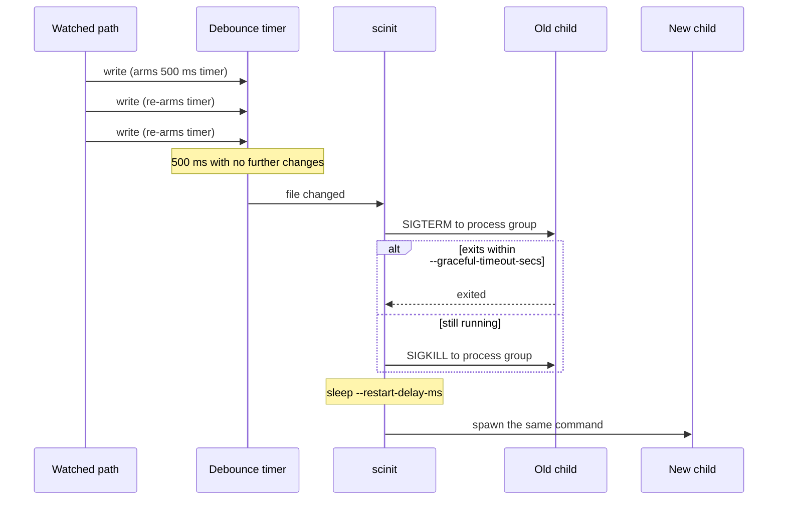

# Live reload

Live reload was designed for remote development environments. When a system has too many services to run on a laptop, development moves to a remote environment, a Docker host or a Kubernetes cluster. It is built for a particular way of working there, described in [remote development environments](remote-development.md): the service then can stay deployed in the cluster and only the code or binary needs to change. No traffic needs to be routed to your laptop, and a code change doesn't need to re-apply manifests or recreate the pod. Instead, you can edit code locally, the changes can be synchronized into the running container and rebuilt there, and the running service then needs to pick up the new build. A typical setup is a development pod in which a sidecar container can recompile the program whenever its sources change and write the new binary into a volume shared with the application container.

That last step, swapping the running process for the new build, is hard to do from outside the container. Restarting the whole container or pod is slow, drops every open connection, and in Kubernetes can mean rescheduling. Running a separate file watcher inside the container is better, but that watcher then becomes PID 1 or has to be supervised by one, and you are back to the problems an init exists to solve.

scinit already sits between the container runtime and your application, so it does this job itself. With `--watch`, it watches the program's own executable (and any extra paths you give it) and, when the contents change, stops the child the same way `docker stop` would and starts a fresh one from the new build. Combined with [socket activation](socket-activation.md), clients connecting during the restart, whether a browser, a `kubectl port-forward` or another service in the cluster, wait in the kernel's queue instead of being refused.

## How a change becomes a restart

Two things happen between a file being written and the new process starting: the change is debounced, then the child is restarted.

Editors and build tools rarely write a file once. A save can be a truncate followed by several writes, a compiler may write an output in chunks, and a `git checkout` touches many files in a burst. Restarting on the first event would start the new process against a half-written file, and restarting on every event would restart many times for one change. scinit uses a trailing-edge debounce instead. Each relevant change arms a timer of `--debounce-ms` (500 ms by default). Another change before the timer fires re-arms it from zero. Only when the watched paths have been quiet for the full interval does scinit restart, so the restart always sees the last write. The debounce can't tell a finished build from one that pauses for longer than `--debounce-ms`, for example a large binary copied slowly into a volume; a [sentinel file](#waiting-for-the-build-with-a-sentinel-file) removes that guess.

The restart itself reuses scinit's normal shutdown path. scinit sends SIGTERM to the child's process group and waits up to `--graceful-timeout-secs` (30 s by default) for the child to exit. If it is still running, scinit sends SIGKILL. It then waits `--restart-delay-ms` (1000 ms by default) and spawns the command again with the same arguments and environment. A SIGTERM, SIGINT or SIGQUIT that arrives before the new spawn cancels the restart and shuts scinit down instead (see [signals and shutdown](signals-and-shutdown.md)).



## Choosing what to watch

`--watch` watches the executable scinit is about to run, looked up in `PATH` the same way exec would. That suits compiled programs, but not interpreted ones. For `scinit --watch -- python app.py`, the executable is the Python interpreter, which never changes, so add your source with `--watch-extra`: `scinit --watch --watch-extra app.py -- python app.py`.

`--watch-extra <PATH>` adds a file or directory to watch, and can be given more than once. A change to any watched path restarts the child.

A single file, the executable included, is watched through its parent directory, and only events for that file's name count. Replacing the file restarts the child, whether a new file is renamed over it or it is deleted and written again, which is how many editors save and how `install` and many build tools write their output. The watch keeps working after any number of replacements. Changes to the other files in the directory are ignored. If a watched file is a symlink, scinit resolves it once at startup and watches the file it points to, so replacing the symlink itself is not seen.

Directories are watched non-recursively. scinit sees changes to files directly inside the directory, but not in its subdirectories. If your code lives in a tree, pass the directory whose files change, such as the build output directory, rather than the project root.

Not every event counts. A change triggers a restart if it modifies a file's contents or renames a file. Renames matter because many editors save by writing a temporary file and renaming it over the original. Creating an empty file, deleting one, and metadata-only changes such as `touch`, `chmod` or a new timestamp do not count. scinit also checks that the path in the event is a regular file when the event arrives, so changes to directories, and to files that are already gone, are ignored. The sentinel file below is the one exception.

### Waiting for the build with a sentinel file

Watching the executable means scinit has to guess when a build is finished: it restarts once events go quiet for `--debounce-ms`. A binary written in place in chunks, or a build that writes several files, can pause for longer than that, and scinit then runs a half-written or inconsistent build.

With `--watch-sentinel`, changes to the executable no longer restart the child. scinit watches a sentinel file next to it instead, named after the executable with `.scinit` appended: for `server` found in `PATH` at `/app/bin/server`, the sentinel is `/app/bin/server.scinit`. If the executable is a symlink, the sentinel sits next to the symlink. The builder writes the whole build first, then touches the sentinel:

```sh
cp target/debug/server /app/bin/server
touch /app/bin/server.scinit
```

For the sentinel, creating it and any change to it count, including a metadata-only change such as `touch`. Deleting it doesn't. It doesn't need to exist when scinit starts, so the first build can create it. The debounce still applies, so two touches within `--debounce-ms` give one restart. The sentinel is watched through the same directory watch as the executable would be.

`--watch-extra` paths still restart the child on their own when a sentinel is used, since changes such as config edits don't go through the builder.

## Worked example

This example runs a small shell script, `/app/server`, that prints its config and exits cleanly on SIGTERM. The config lives in `/app/config/app.conf`, so that directory is watched too. We write the config three times, 200 ms apart, then stop scinit with SIGTERM. The output was captured on Linux, with `SCINIT_LOG=info` to show scinit's own log lines. The lines starting with `server:` come from the child.

```console
$ SCINIT_LOG=info scinit --watch --watch-extra /app/config -- server
 INFO scinit: scinit starting
 INFO scinit: init system started, managing subprocess: server
 INFO scinit::file_watcher: Started watching path: "/app/server"
 INFO scinit::file_watcher: Started watching path: "/app/config"
 INFO scinit: File watching started for live-reload
 INFO scinit::process_manager: Spawning process: server []
 INFO scinit::process_manager: Process spawned with PID: 15
server: started, pid 15, config v1
 INFO scinit: File changed: "/app/config/app.conf", triggering restart
 INFO scinit::process_manager: Restarting process due to file change
 INFO scinit::process_manager: Initiating graceful shutdown of process 15 with SIGTERM
server: got SIGTERM, exiting
 INFO scinit::process_manager: Process exited gracefully
 INFO scinit::process_manager: Spawning process: server []
 INFO scinit::process_manager: Process spawned with PID: 45
server: started, pid 45, config v4
 INFO scinit: received termination signal SIGTERM, initiating graceful shutdown
 INFO scinit: Termination signal SIGTERM received, forwarding to child process (timeout: 30s)
 INFO scinit::process_manager: Initiating graceful shutdown of process 45 with SIGTERM
server: got SIGTERM, exiting
 INFO scinit::process_manager: Process exited gracefully
 INFO scinit: scinit exiting due to termination signal SIGTERM
 INFO scinit: scinit exiting with code 0
```

The three writes produced one restart, and the new process saw the last version (`v4`). The pause between `Process exited gracefully` and the next `Spawning process` is the one-second restart delay.

With `--watch-sentinel`, replacing the executable doesn't restart the child, and touching the sentinel does. Here `/app/bin/server` was replaced by rename, and two seconds later `/app/bin/server.scinit` was touched (captured on macOS):

```console
$ SCINIT_LOG=info scinit --watch --watch-sentinel -- server
 INFO scinit: scinit starting
 INFO scinit: init system started, managing subprocess: server
 INFO scinit::file_watcher: Started watching sentinel: "/app/bin/server.scinit"
 INFO scinit: File watching started for live-reload
 INFO scinit::process_manager: Spawning process: server []
 INFO scinit::process_manager: Process spawned with PID: 33962
server: started, pid 33962
 INFO scinit: File changed: "/app/bin/server.scinit", triggering restart
 INFO scinit::process_manager: Restarting process due to file change
 INFO scinit::process_manager: Initiating graceful shutdown of process 33962 with SIGTERM
server: got SIGTERM, exiting
 INFO scinit::process_manager: Process exited gracefully
 INFO scinit::process_manager: Spawning process: server []
 INFO scinit::process_manager: Process spawned with PID: 34303
server: started, pid 34303
```

If the command can't be found in `PATH`, scinit refuses to start rather than watching nothing:

```console
$ scinit --watch -- my-app
ERROR scinit: --watch: cannot find 'my-app' in PATH to watch
```

In a development container, the usual setup has a build sidecar write the binary into a shared volume and touch the sentinel, with socket activation so the port stays open:

```sh
scinit --watch --watch-sentinel \
       --ports 8080 --bind-addr 0.0.0.0 \
       -- /app/bin/server
```

## Why it pairs with socket activation

When a server binds its own port, there is a gap during every restart. The old process closes its listening socket as it exits, the restart delay passes, and the new process binds the port again once it has started. A client that connects inside that gap gets "connection refused", and for a browser refreshing as you save, that gap is exactly when it connects.

With `--ports`, scinit binds the listening sockets itself, once, and hands the same sockets to every child. While no child is running, the sockets stay open and the kernel keeps accepting connections into their backlog. When the new child starts, it accepts them. The client sees a slower response instead of an error. The [socket activation guide](socket-activation.md) shows a connection made in the middle of a restart being answered by the new process.

## Things to know

If the child exits on its own, whether it crashed or finished cleanly, scinit exits with the child's status, even with live reload on. It does not wait for the next file change. This is deliberate: in a container, a crash should end the container so the orchestrator sees it and can restart or report it, rather than leaving a running container with nothing inside. The cost is in development loops, where a syntax error that makes the app exit immediately also stops the container. Let your container runtime restart it, or have your app stay up and report the error instead of exiting.

```console
$ SCINIT_LOG=info scinit --watch --watch-extra config -- sh -c 'exit 3'
 INFO scinit: scinit starting
 INFO scinit: init system started, managing subprocess: sh
 INFO scinit::file_watcher: Started watching path: "/bin/sh"
 INFO scinit::file_watcher: Started watching path: "config"
 INFO scinit: File watching started for live-reload
 INFO scinit::process_manager: Spawning process: sh ["-c", "exit 3"]
 INFO scinit::process_manager: Process spawned with PID: 95545
 INFO scinit::exit_status: Child process exited with error code 3, scinit exiting
 INFO scinit: scinit exiting with code 3
$ echo $?
3
```

The restart always sends SIGTERM, and it waits the full graceful timeout for a child that ignores it. With the default of 30 seconds, a server that doesn't handle SIGTERM makes every reload take 30 seconds. In development, either handle SIGTERM or lower `--graceful-timeout-secs`.

`--watch-sentinel`, `--watch-extra`, `--debounce-ms` and `--restart-delay-ms` require `--watch`. Without it, scinit exits with a usage error (exit code 2) before starting the child:

```console
$ scinit --debounce-ms 100 -- my-app
error: the following required arguments were not provided:
  --watch

Usage: scinit --watch --debounce-ms <DEBOUNCE_MS> <COMMAND>...

For more information, try '--help'.
```

Because the debounce is trailing-edge, a path that keeps changing more often than the debounce interval never triggers a restart until it settles. Changes that arrive while a restart is in progress are not lost: they cause one more restart once the current one completes. A consequence is that if your app writes into the directory being watched, for example a log or PID file, every start causes a change and the app restarts in a loop. Keep such files outside the watched path. Editors can cause the same thing: a swap or backup file written next to the file you are editing, such as Vim's `.swp`, counts as a content change in a watched directory.

On macOS, file events come from FSEvents, which does not always report exactly what happened. It can report a file written shortly before scinit started as changed, which causes one restart right after startup. In our tests it also reported earlier writes along with later metadata-only changes, so a `touch` or `chmod` on a recently written file could restart the child, which doesn't happen on Linux. Inside a Linux container, even on a Mac host, you get inotify's behavior.

## Related

[Getting started](../getting-started.md) walks through a first live-reload loop, and the [CLI reference](../reference/cli.md) lists every flag and default. [Socket activation](socket-activation.md) covers keeping ports open across restarts, [signals and shutdown](signals-and-shutdown.md) covers the SIGTERM and SIGKILL sequence restarts reuse, [exit codes](exit-codes.md) explains what scinit exits with when the child stops on its own, and [logging](logging.md) shows how to see what the watcher is doing. For background, see [why an init](why-an-init.md), [zombie reaping](zombie-reaping.md) and [process isolation](process-isolation.md).
