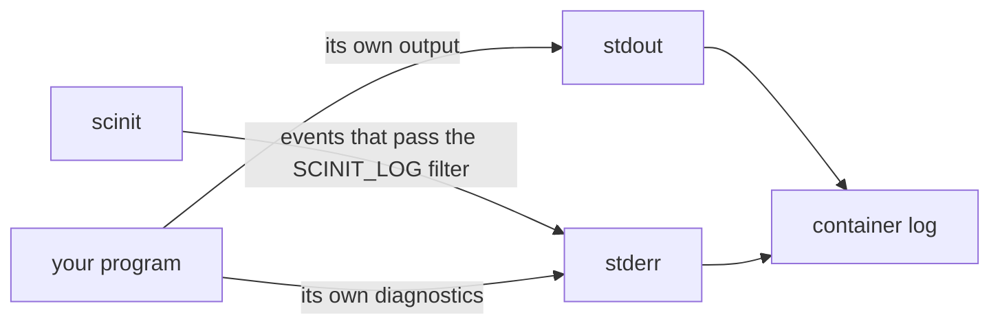

# Logging

An init's own log output shares the container's output streams with your application. Everything the container prints is your application's output, and that is what you want to read. Anything the init adds has to stay out of the way: it must not touch the app's stdout, it must not fill the logs during normal operation, and it must be easy to tell apart from the app's own lines. But when something goes wrong, such as a restart that didn't happen or a shutdown that took 30 seconds, the init is the only one that knows why.

So scinit is quiet by default and detailed on request. It only prints errors unless you ask for more with the `SCINIT_LOG` environment variable. It writes to stderr only, never stdout, and every line names the part of scinit that wrote it.



## The format

Each event is one line, in the standard format of Rust's `tracing` library without a timestamp:

```text
LEVEL target: message
```

The level is `ERROR`, `WARN`, `INFO`, `DEBUG` or `TRACE`, right-aligned, so `INFO` and `WARN` get a leading space. The target is `scinit` or one of its modules, such as `scinit::process_manager` or `scinit::file_watcher`. Because every target starts with `scinit`, its lines are easy to pick out of the child's output, which is mixed into the same stderr:

```text
 INFO scinit::process_manager: Process spawned with PID: 15
server: started, pid 15, config v1
 INFO scinit: File changed: "/app/config/app.conf", triggering restart
```

There is no timestamp because container log drivers already record one per line, and a second one only adds noise. tini, dumb-init and catatonit leave it out for the same reason.

Output is colored only when stderr is a terminal and the `NO_COLOR` environment variable is unset. Container logs and files never get escape codes, and `NO_COLOR=1` turns color off on a terminal too.

Fatal errors use the same format. When scinit can't start, the reason is a single `ERROR` line and scinit exits with code 1:

```console
$ scinit -- nonexistent-cmd
ERROR scinit: Failed to spawn process 'nonexistent-cmd': No such file or directory (os error 2)
```

Panics, which would be bugs in scinit, are logged the same way, as an `ERROR` line from the `scinit::logging` target that starts with `panic at` followed by the source location and the message, instead of Rust's default panic output.

## Choosing what to see

`SCINIT_LOG` takes the filter syntax of `tracing`'s `EnvFilter`. The simplest form is a level: `error` (the default), `warn`, `info`, `debug` or `trace`. Each level includes the ones above it.

`info` is the useful level for watching what scinit does. It shows each spawn, each signal and how it was handled, each restart and the exit code. `debug` adds detail such as every raw file system event, each zombie reaped, and the signal and terminal setup at startup.

You can also set the level per module, by naming the target. Directives are separated by commas, and the most specific one wins. A common combination is a general level plus detail for one module:

```sh
SCINIT_LOG=info,scinit::file_watcher=debug
```

Include a general level whenever you name a module. A filter made only of module directives, such as `SCINIT_LOG=scinit::file_watcher=debug`, turns off everything else, including errors from other modules.

`RUST_LOG` is not read by scinit. It is passed to the child unchanged, so setting it for a Rust application doesn't make scinit verbose, and setting `SCINIT_LOG` doesn't affect your application:

```console
$ RUST_LOG=info scinit -- sh -c 'echo child sees RUST_LOG=$RUST_LOG'
child sees RUST_LOG=info
```

## Troubleshooting

### My app didn't restart

Start with `SCINIT_LOG=info,scinit::file_watcher=debug`. At startup, look for the line naming the watched path:

```text
 INFO scinit::file_watcher: Started watching path: "/app/config"
```

If it is missing, live reload isn't on. `--watch-path`, `--debounce-ms` and `--restart-delay-ms` are silently ignored without `--live-reload`. If the path is not the one you expected, remember that without `--watch-path` scinit watches the command's executable, which for an interpreted app is the interpreter.

Then make the change and look at the events. This run on Linux watched `/app/config` and made three changes: a `touch` of `app.conf`, a write to a file in a subdirectory, and a write to `app.conf` itself. The output is shortened to the relevant lines, and the `attr:` fields at the end of each event are cut:

```text
+ touch config/app.conf
DEBUG scinit::file_watcher: File system event: Event { kind: Modify(Metadata(Any)), paths: ["/app/config/app.conf"], ...
+ echo x > config/nested/extra.conf
+ echo v5 > config/app.conf
DEBUG scinit::file_watcher: File system event: Event { kind: Modify(Data(Any)), paths: ["/app/config/app.conf"], ...
 INFO scinit: File changed: "/app/config/app.conf", triggering restart
```

Each case shows one of the reasons a change doesn't cause a restart. The `touch` produced an event, but a metadata-only one, which scinit ignores. The write to `config/nested/extra.conf` produced no event at all, because directories are watched non-recursively. Only the content change to a file directly in the watched directory led to `File changed`. A restart arrives `--debounce-ms` after the last change, so a file that keeps changing delays it.

If you see no events at all for a file you are sure changed, and you are watching a single file on Linux, the file may have been replaced by a rename, which loses the watch. Watch the directory instead. The [live reload guide](live-reload.md) covers this and the other cases in detail.

### The container takes several seconds to stop

That is the graceful timeout running out: the child didn't exit on the termination signal, so scinit waited the graceful timeout (8 seconds by default, 25 under Kubernetes; see [choosing the graceful timeout](signals-and-shutdown.md#choosing-the-graceful-timeout)) before sending SIGKILL. With `SCINIT_LOG=info` it is easy to confirm. This run used a child that ignores SIGTERM, with the timeout lowered to 3 seconds:

```text
 INFO scinit: received termination signal SIGTERM, initiating graceful shutdown
 INFO scinit: Termination signal SIGTERM received, forwarding to child process (timeout: 3s)
 INFO scinit::process_manager: Initiating graceful shutdown of process 93999 with SIGTERM
 WARN scinit::process_manager: Graceful shutdown timeout, forcing kill
 INFO scinit::process_manager: Force killing process 93999
 INFO scinit::process_manager: Process killed, exit status: ExitStatus(unix_wait_status(9))
 INFO scinit: scinit exiting due to termination signal SIGTERM
 INFO scinit: scinit exiting with code 137
```

The `WARN ... forcing kill` line is the sign. The fix is in the application: handle SIGTERM and exit. Common causes are a shell script wrapper that runs the app without `exec` and doesn't pass the signal on, or a runtime that installs its own handler and waits for open connections. A live-reload restart does the same with its own, shorter timeout, `--restart-timeout-secs` (2 seconds by default), and logs `WARN scinit::process_manager: Restart timeout, forcing kill`. The [signals and shutdown guide](signals-and-shutdown.md) has the details, and [exit codes](exit-codes.md) explains the 137.

### The client gets connection refused

First check whether scinit is holding the port at all. With `--ports`, the `scinit::port_manager` lines say what was bound and where:

```text
 INFO scinit::port_manager: Binding 2 ports to 127.0.0.1
 INFO scinit::port_manager: Bound port 8080 to 127.0.0.1:8080
 INFO scinit::port_manager: Bound port 8081 to 127.0.0.1:8081
 INFO scinit::port_manager: Successfully bound 2 ports
```

`127.0.0.1` is the default, and it is the most common cause when the client is outside the container: published ports reach the container's external interface, not its loopback. Use `--bind-addr 0.0.0.0` (or `::`). Depending on the container runtime, the client may see an empty reply or a reset instead of a refusal.

If there are no `port_manager` lines, scinit isn't binding anything and your app opens the port itself. Then the port is closed whenever the app isn't running, including during every live-reload restart, and connections in that window are refused. Passing the port with `--ports` and adopting the inherited socket in the app keeps it open; see [socket activation](socket-activation.md).

If the lines are there and the bind address is right, the app may be ignoring the inherited socket and binding the port itself, which fails because scinit already holds it, or listening on a different port. Check the app's own startup output.

## Things to know

`SCINIT_LOG` falls back to `error` only when the filter can't be parsed. Some mistakes parse fine and silence everything instead, fatal errors included. `SCINIT_LOG=inf` is read as "show events from a module named `inf`", which matches nothing, and an empty value (`SCINIT_LOG=`) is a filter with no directives at all. In both cases scinit prints nothing, even when it fails to start. If scinit exits with code 1 and no message, check this variable first.

scinit has no log file, no JSON output and no syslog support. Its lines go to stderr alongside your application's, and the container runtime collects both.

## Related

[Getting started](../getting-started.md) uses `SCINIT_LOG=info` to watch a shutdown, and the [CLI reference](../reference/cli.md) lists the environment variables scinit reads. The troubleshooting sections lead into [live reload](live-reload.md), [signals and shutdown](signals-and-shutdown.md), [exit codes](exit-codes.md) and [socket activation](socket-activation.md). See also [why an init](why-an-init.md), [zombie reaping](zombie-reaping.md) and [process isolation](process-isolation.md).
