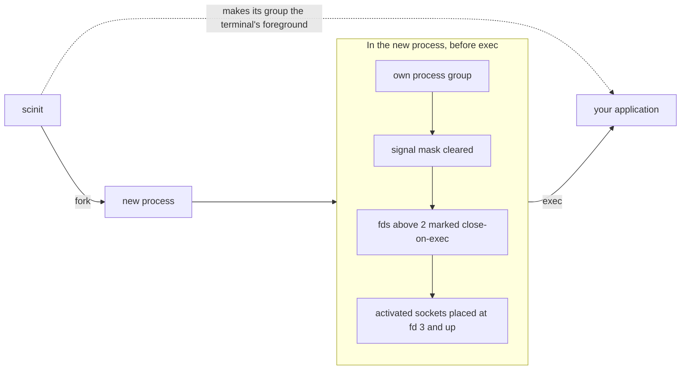

# Process isolation

A child process inherits a lot from its parent: a process group, a signal mask, signal dispositions, open file descriptors, the environment, the working directory, and a place in relation to the terminal. Most of the time that is exactly what you want. An init is different, because it sets up its own process state for its own purposes, and some of that state would be wrong for the application it runs. scinit blocks several signals on every thread, for example, and an application that inherited that mask would never see SIGTERM.

So each time scinit starts the child, at startup and on every live-reload restart, it adjusts what the child inherits. The child gets its own process group, an empty signal mask, the terminal's foreground when there is a terminal, and no file descriptors beyond stdio and the sockets scinit hands it on purpose. Everything else, including the environment, working directory and stdio, is passed through unchanged.



## Its own process group

A process group is a set of processes that can be signalled together, and it is the unit the terminal uses for job control. scinit starts the child as the leader of a new process group, whose ID is the child's own PID. Every process the child starts joins that group unless it deliberately moves elsewhere. This gives scinit a handle on the child's whole process tree: forwarded signals and the SIGKILL at the end of the graceful timeout are sent to the group, not just to one PID, so workers get the same signal as their parent. The [signals and shutdown guide](signals-and-shutdown.md#why-the-process-group) explains why forwarding works this way.

It also keeps scinit out of the child's group. Signals aimed at the child's group, by scinit, by the terminal, or by the child signalling its own group with `kill 0`, never hit scinit.

```console
$ scinit -- sh -c 'echo "scinit pid=$PPID child pid=$$"; ps -o pid,ppid,pgid,command -p $PPID,$$'
scinit pid=95936 child pid=95937
  PID  PPID  PGID COMMAND
95936 95934 95934 scinit -- sh -c echo "scinit pid=$PPID child pid=$$"; ps -o pid,ppid,pgid,command -p $PPID,$$
95937 95936 95937 sh -c echo "scinit pid=$PPID child pid=$$"; ps -o pid,ppid,pgid,command -p $PPID,$$
```

scinit stays in the group of the shell that started it (95934), and the child leads a group of its own (95937).

## An empty signal mask

scinit blocks SIGTERM, SIGINT, SIGQUIT, SIGUSR1, SIGUSR2 and SIGHUP on all of its threads so that one dedicated thread can collect them. The signal mask survives both `fork` and `exec`, so without intervention the child would start with those six signals blocked. A program that installs a SIGTERM handler would still never see a SIGTERM, and one that relies on the default action wouldn't die from it. Blocked signals are rarely something an application checks for, which makes this kind of bug hard to diagnose.

Between fork and exec, scinit's child process clears its signal mask, so the application starts with nothing blocked, as it would when started from a shell.

## The terminal's foreground

When you run a program in a terminal, the terminal delivers Ctrl-C (SIGINT), Ctrl-\ (SIGQUIT) and Ctrl-Z (SIGTSTP) to its foreground process group, and only processes in that group may read from it. When your shell starts scinit, scinit's group is in the foreground. Since the child has its own group, it would be in the background: it would not receive Ctrl-C directly, and reading from the terminal would stop it.

So after each spawn, scinit makes the child's process group the terminal's foreground group. This happens only when scinit has a controlling terminal, which it checks by opening `/dev/tty`; in a container without `-t`, or under a process manager, there is none, and the step is skipped. When there is a terminal, Ctrl-C goes straight to the child, as if you had started it from the shell yourself. Here is a Ctrl-C typed into a terminal running scinit, with `SCINIT_LOG=info`:

```console
$ SCINIT_LOG=info scinit -- sh -c 'trap "echo child: got INT; exit 130" INT; echo running; sleep 1000 & wait'
 INFO scinit: scinit starting
 INFO scinit: init system started, managing subprocess: sh
 INFO scinit::process_manager: Spawning process: sh ["-c", "trap \"echo child: got INT; exit 130\" INT; echo running; sleep 1000 & wait"]
 INFO scinit::process_manager: Process spawned with PID: 93628
running
^Cchild: got INT
 INFO scinit::exit_status: Child process exited with error code 130, scinit exiting
 INFO scinit: scinit exiting with code 130
```

scinit never logs a SIGINT here: the terminal delivered it to the child directly, the child exited with 130, and scinit exited with the child's code. Because the handoff happens on every spawn, Ctrl-C keeps working after a live-reload restart.

## Only the file descriptors it should have

A process can hold file descriptors it doesn't know about. Whatever started scinit may have leaked some into it: a socket from a CI runner, a pipe from a test harness, a file from a shell redirection. Any descriptor that isn't marked close-on-exec survives `exec` and reaches the child, where it can keep a pipe open so the other end never sees EOF, hold a port, or confuse a program that scans its descriptors for inherited sockets.

scinit follows systemd's rule: the child gets stdio (descriptors 0, 1 and 2) and, with `--ports`, the listening sockets at descriptors 3 and up, and nothing else. Between fork and exec, the child marks every descriptor above 2 close-on-exec. On Linux it does this with a single `close_range` call; elsewhere, or on kernels without `close_range`, it sets the flag on each descriptor number in turn, up to the process's open-file limit or 65536, whichever is lower. The activated sockets are then copied into place at descriptor 3 and up, which gives them fresh descriptors without the flag, so they are the only ones that survive the exec. [Socket activation](socket-activation.md) covers how they are numbered.

Using the test fixture's `dump` mode, which reports the child's open descriptors, with stray descriptors 7 and 9 opened on scinit by the shell:

```console
$ scinit -- scinit-test-child dump --then-exit 7</etc/hosts 9</etc/hosts
fds pid=93572 open=0,1,2 sockets=
$ scinit --ports 8080,8081 -- scinit-test-child dump --env LISTEN_FDS --then-exit 7</etc/hosts
env pid=93574 key=LISTEN_FDS value=2
env pid=93574 key=LISTEN_PID value=93574
fds pid=93574 open=0,1,2,3,4 sockets=3,4
```

(The fixture reports each observation on stderr and in the file named by `$SCINIT_TEST_REPORT`. Only the relevant lines are shown, with their timestamps removed.)

## Environment, working directory and stdio

The child inherits scinit's environment unchanged, including variables that aren't valid UTF-8, and scinit's working directory and stdin, stdout and stderr. scinit's own logs go to stderr, so stdout carries nothing but the child's output; see [logging](logging.md).

There is one adjustment. Variables starting with `LISTEN_` describe sockets passed by socket activation, and if scinit inherited some from its own parent, they describe that parent's sockets, which the child doesn't have. scinit removes them from the child's environment. With `--ports`, it sets `LISTEN_FDS` and `LISTEN_PID` for the sockets it actually passes.

## Things to know

scinit ignores SIGTTIN and SIGTTOU for itself, so that background terminal I/O can never stop the container's init. An ignored signal stays ignored across `exec`, so the child starts with SIGTTIN and SIGTTOU ignored too, unlike a program started from a shell. For most applications this makes no difference, and programs that care about job control (shells, for example) set these dispositions themselves. You can see it in `/proc` on Linux, where bits 21 and 22 (the two signals' numbers) are set in the ignored mask while the blocked mask is empty:

```console
$ scinit -- sh -c 'grep -E "^(SigBlk|SigIgn)" /proc/self/status'
SigBlk:	0000000000000000
SigIgn:	0000000000300000
```

There is no option to set or remove environment variables for the child. Set them on scinit, with `ENV` in the Dockerfile, `-e` on `docker run`, or `env` in front of the command (`scinit -- env FOO=bar my-server`).

If scinit has a terminal but can't make the child's group the foreground group, that is treated as an error: scinit kills the child's process group and exits with 1.

Processes that leave the child's process group, for example by calling `setsid` to daemonize, are outside the group that scinit signals; [signals and shutdown](signals-and-shutdown.md#things-to-know) describes what that means for a shutdown.

## Related

[Getting started](../getting-started.md) shows scinit in a terminal and in a container. The [CLI reference](../reference/cli.md) lists every flag. [Signals and shutdown](signals-and-shutdown.md) explains how the process group is used for forwarding, [socket activation](socket-activation.md) covers the descriptors passed with `--ports`, and [logging](logging.md) describes scinit's stderr output.
