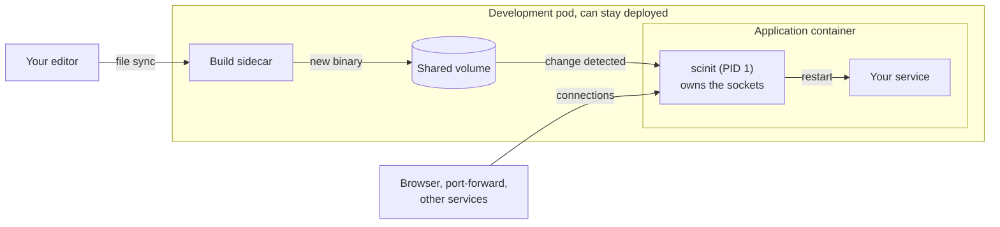
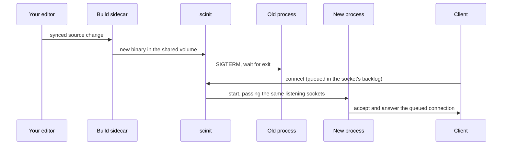

# Remote development environments

In an organization with many services, running everything on a laptop is a hassle and often impossible: there are too many services, too much data, and too many dependencies on the real infrastructure. So development moves to a remote environment, a Docker host or a Kubernetes cluster, and the existing tools mostly take one of two routes. Some keep your service running on your laptop and route network traffic between it and the cluster, as [Telepresence](https://www.telepresence.io) does. Others, such as [Garden](https://garden.io) and [Tilt](https://tilt.dev), are built around a deploy loop: a change rebuilds the image and re-applies the manifests, and the cluster replaces the pods.

scinit's live reload and socket inheritance were designed for a different approach. The service runs in the cluster and then can stay deployed, and only the code or binary needs to change: no traffic needs to be routed to your laptop, a code change doesn't need to touch the manifests or recreate the pod, and the running process can be swapped for the new build in place. This guide describes how such an environment fits together and what scinit's part in it is.

## The pieces

A development environment built this way has four parts, and scinit has the narrowest responsibility of them. A deployment tool can set up the development pod once: an application container whose entrypoint is scinit, a build sidecar next to it, and a volume the two share. A file-sync tool such as [Mutagen](https://mutagen.io), or something simpler, can keep the source code inside the pod in step with your editor. The build sidecar can watch those sources, recompile the program when they change, and write the new binary into the shared volume. scinit runs the program in the application container and owns two things: the running process, and the listening sockets clients connect to.

scinit doesn't sync files, build code or talk to Kubernetes. Its only inputs are a file on disk changing and the ports it was asked to hold, so it works with any sync tool, any build command and any orchestrator, and each piece can be swapped without touching the others.

## One change, start to finish

When you save a file, the change can travel through each piece in turn. The sync tool can copy it into the pod, and the build sidecar can compile a new binary into the shared volume. scinit then sees the binary change, waits for the writes to settle, stops the old process the same way `docker stop` would, and starts the new build. That part is [live reload](live-reload.md), which covers what scinit watches, how the debounce works, and how a restart is sequenced.

Restarting a server normally leaves a window in which nothing listens on its port, and every client in that window, from your browser to a `kubectl port-forward` to another service in the cluster, gets "connection refused". With `--ports`, scinit binds the listening sockets itself before starting your program and passes the same sockets to every new process, using the systemd socket-activation protocol. A connection made during a restart waits in the socket's backlog and is answered by the new build, so clients don't see the restart as an error. [Socket activation](socket-activation.md) explains the protocol, how your program picks the sockets up, and how restarts look to Kubernetes probes.

## From development to production

The application container in a development pod and the one you ship can differ only in their flags. In production you can drop the live-reload options, and scinit is a plain container init: it forwards signals, shuts down gracefully, reaps zombies and exits with your program's status, and a crash ends the container so the orchestrator can see it. `--ports` can stay, since a program that adopts inherited sockets runs the same way with or without restarts. Keeping one entrypoint for both means the process model you develop against is the one you deploy.

## Things to know

scinit decides that a build is finished when the files it watches have been quiet for `--debounce-ms`. A binary written slowly in place, or a build that writes several files, can pause longer than that, so scinit may start a half-written build. A trigger file the build sidecar touches when it is done is planned in [#30](https://github.com/divoxx/scinit/issues/30).

When the program exits on its own, scinit exits too, even with live reload on, so a build that crashes at startup ends the container. Waiting for the next change instead is planned in [#22](https://github.com/divoxx/scinit/issues/22).

## Related

[Live reload](live-reload.md) and [socket activation](socket-activation.md) cover the two features in depth. [Getting started](../getting-started.md) has a first local live-reload loop, and the [command-line reference](../reference/cli.md) lists every flag. [Why a container needs an init](why-an-init.md) explains the init side that the same entrypoint relies on in production.
