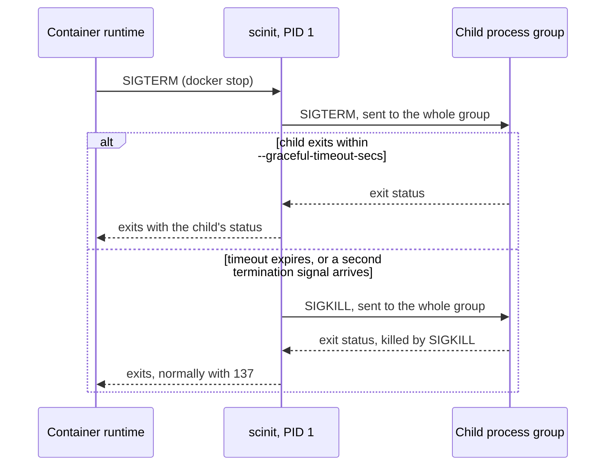

# Signals and shutdown

Stopping a container is a conversation carried out in signals. The runtime sends SIGTERM to PID 1, waits, and sends SIGKILL if the container is still running when its patience runs out. Kubernetes does the same with `terminationGracePeriodSeconds`. For a stop to be graceful, the signal has to reach your application, the application has to get time to finish its work, and something has to make sure the stop actually completes if the application hangs.

As PID 1, scinit sits in the middle of that conversation. It receives the runtime's signals, passes them on to your application's process group, and enforces its own deadline: if the application hasn't exited within `--graceful-timeout-secs` (30 seconds by default), scinit sends SIGKILL to the whole group and exits.



## What scinit does with each signal

scinit handles six signals, in two groups.

SIGTERM, SIGINT and SIGQUIT are termination signals. When scinit receives one, it forwards that same signal to the child's process group, so an application that treats SIGINT differently from SIGTERM (as some servers do for a fast versus a graceful stop) sees the signal that was actually sent. scinit then waits for the child to exit. If it exits within the graceful timeout, scinit exits with the child's status. If it doesn't, or if another termination signal arrives first, scinit sends SIGKILL to the process group, waits briefly for the child to be collected, and exits. Either way, a termination signal always ends scinit.

SIGUSR1, SIGUSR2 and SIGHUP are forwarded to the child's process group and nothing else happens. Applications commonly use these for reloading configuration or reopening log files, and scinit stays out of the way: it doesn't restart anything, and it keeps running.

Two signals are explicitly ignored. SIGTTIN and SIGTTOU are sent to a background process that tries to read from or write to its terminal, and their default action is to stop the process. scinit ignores them so that it can never be stopped by a terminal operation, which would freeze the whole container. The child doesn't inherit that: it starts with every signal at its default disposition (see [process isolation](process-isolation.md#default-signal-dispositions)).

Finally, some signals are deliberately left alone. SIGCHLD, which tells a parent that a child changed state, is used by scinit to reap zombies and to notice the child's exit (see [zombie reaping](zombie-reaping.md)). Synchronous signals that the kernel raises because of a fault in scinit itself, such as SIGSEGV, SIGBUS, SIGFPE and SIGILL, are never blocked or intercepted, so a crash in scinit is a real crash and not a hang.

## Why the process group

scinit starts the child as the leader of a new process group and sends every forwarded signal to that group (with `kill(-pgid, signal)`), not just to the child's PID. Many applications are a small tree of processes: a shell script that runs a server, a server with worker processes, a supervisor that starts helpers. Signalling only the top process relies on it to pass the signal on, and many don't, which leaves workers running after their parent has exited. Signalling the group reaches every process that hasn't moved itself into a different group, the same way Ctrl-C in a terminal reaches every process in a pipeline. The SIGKILL at the end of the graceful timeout goes to the group for the same reason, so when the timeout runs out, nothing that stayed in the group survives it.

The [process isolation guide](process-isolation.md#its-own-process-group) shows the group being set up, along with what else the child gets at startup.

## How scinit receives signals

The usual way to handle a signal is to install a handler function, but a handler runs at an arbitrary point in the program and may only do a very small set of things safely, which makes it a poor place for "forward this signal and start a timed shutdown". scinit takes a different approach. At startup, before it creates any other thread, it blocks the six signals it handles. Threads inherit the signal mask of the thread that created them, so every thread scinit later starts, including all of tokio's worker threads, has them blocked too. One dedicated thread, named `scinit-sigwait`, then sits in a loop calling `sigwait`, which takes a pending blocked signal off the queue and returns it as an ordinary value. That thread sends each signal over a channel to scinit's main loop, which decides what to do with it alongside the other events it watches.

This design has three properties that matter. A blocked signal is never delivered to a random thread or run as a default action, so there is no window in which a SIGTERM could kill scinit outright. A blocked signal is queued by the kernel rather than discarded, which is what lets scinit receive signals when it is PID 1, where the kernel would drop an unhandled signal. And because signals wait in a channel, a signal that arrives while the main loop is busy, for example in the middle of a live-reload restart, is handled when the loop gets to it rather than lost.

The child doesn't inherit this arrangement. Before the child's program starts, scinit clears its signal mask so that it handles signals normally.

## Worked examples

The examples use `sh -c` scripts as stand-in applications and `SCINIT_LOG=info` to show what scinit does. A child that handles SIGTERM and exits cleanly:

```console
$ SCINIT_LOG=info scinit -- sh -c 'trap "echo child: got TERM, cleaning up; exit 0" TERM; sleep 1000 & wait' &
$ kill -TERM %1
[info]  scinit: scinit starting
[info]  scinit: init system started, managing subprocess: sh
[info]  scinit: Spawning process: sh ["-c", "trap \"echo child: got TERM, cleaning up; exit 0\" TERM; sleep 1000 & wait"]
  [ok]  scinit: Process spawned with PID: 93372
[info]  scinit: received termination signal SIGTERM, initiating graceful shutdown
[info]  scinit: Termination signal SIGTERM received, forwarding to child process (timeout: 30s)
[info]  scinit: Initiating graceful shutdown of process 93372 with SIGTERM
child: got TERM, cleaning up
[info]  scinit: Process exited gracefully
[info]  scinit: scinit exiting due to termination signal SIGTERM
[info]  scinit: scinit exiting with code 0
```

The background `sleep` was in the child's process group, so it received the SIGTERM as well and is gone too. scinit exits 0 because the child did.

A child that ignores SIGTERM, with the timeout shortened to three seconds:

```console
$ SCINIT_LOG=info scinit --graceful-timeout-secs 3 -- sh -c 'trap "echo child: ignoring TERM" TERM; while :; do sleep 0.1; done' &
$ kill -TERM %1
 ...
[info]  scinit: received termination signal SIGTERM, initiating graceful shutdown
[info]  scinit: Termination signal SIGTERM received, forwarding to child process (timeout: 3s)
[info]  scinit: Initiating graceful shutdown of process 93260 with SIGTERM
child: ignoring TERM
[warn]  scinit: Graceful shutdown timeout, forcing kill
[info]  scinit: Force killing process 93260
[info]  scinit: Process killed, exit status: ExitStatus(unix_wait_status(9))
[info]  scinit: scinit exiting due to termination signal SIGTERM
[info]  scinit: scinit exiting with code 137
```

Three seconds after the SIGTERM, scinit gave up, killed the group and exited with 137 (128 + 9, killed by SIGKILL).

A forwarded signal that doesn't stop anything:

```console
$ SCINIT_LOG=info scinit -- sh -c 'trap "echo child: got HUP, reloading" HUP; trap "exit 0" TERM; while :; do sleep 1000 & wait; done' &
$ kill -HUP %1
 ...
[info]  scinit: forwarding signal SIGHUP to child process
child: got HUP, reloading
```

scinit logs the forward and keeps running; the child decides what SIGHUP means.

## Choosing the graceful timeout

scinit's timeout and the runtime's timeout both run from the moment the stop begins, and the shorter one wins. Docker and podman wait 10 seconds by default before sending SIGKILL to PID 1, while scinit's default is 30. With those defaults, a child that takes longer than 10 seconds to exit is never killed by scinit: the runtime kills scinit first, and since scinit is PID 1, the kernel then kills every process in the container. The container still stops, but scinit's escalation and logging never happen, and the exit status is whatever the runtime reports for a killed PID 1.

If you want scinit's escalation to be the one that fires, set `--graceful-timeout-secs` a few seconds below the runtime's grace period, for example 8 under Docker's default of 10, or raise the runtime's (`docker stop -t`, `docker run --stop-timeout`). Kubernetes' default `terminationGracePeriodSeconds` is 30, the same as scinit's default, so the two race; lower scinit's to 25 or so, or raise the grace period. The setting also applies to live-reload restarts, where it bounds how long scinit waits for the old child before starting the new one.

## Things to know

A second termination signal forces the stop. While scinit waits out the graceful timeout, it keeps receiving signals: another SIGTERM, SIGINT or SIGQUIT makes it send SIGKILL to the process group at once, as if the timeout had expired, so pressing Ctrl-C twice or running `kill` twice stops a child that is stuck shutting down. The exit code follows the same rules as a timeout, usually 137. SIGUSR1, SIGUSR2 and SIGHUP received during the wait are forwarded to the stopping child and don't change the timeout.

Only the six signals listed above are forwarded. Others, such as SIGWINCH (terminal resize) and SIGTSTP (Ctrl-Z when sent with `kill`), are not passed on to the child; they take their default action on scinit itself. As PID 1 that means they are discarded, but outside a container a SIGTSTP sent to scinit stops scinit, not the child. When you run scinit in a terminal this matters less than it sounds, because keys like Ctrl-C and Ctrl-Z make the terminal signal its foreground process group, and scinit hands the foreground to the child (see [process isolation](process-isolation.md)), so those reach the child without going through scinit.

scinit waits for the managed child, not for the whole group. If the child exits within the graceful timeout but a worker in its group ignored the signal, scinit exits without killing that worker. As PID 1 this doesn't matter, because the kernel kills everything left in the container when scinit exits; outside a container the worker keeps running. The same goes for a process that moves itself into another process group or session, such as a daemon that calls `setsid`: it is not reached by forwarded signals or by the final SIGKILL, and only the end of the PID namespace cleans it up.

A termination signal that arrives during a live-reload restart, before the new child is spawned, cancels the restart. scinit doesn't start a new child: if the old one is still stopping, scinit forwards the signal to it and waits for it as in any shutdown; then scinit exits with the old child's status. SIGUSR1, SIGUSR2 and SIGHUP that arrive during a restart are held and forwarded to the new child once it is spawned, which can be before it has installed its own signal handlers. The [live reload guide](live-reload.md) describes the restart sequence.

The exit status scinit reports after a shutdown is explained in [exit codes](exit-codes.md).

## Related

[Getting started](../getting-started.md) walks through a first run and a Dockerfile. The [CLI reference](../reference/cli.md) documents `--graceful-timeout-secs`. [Why an init](why-an-init.md) explains why PID 1 needs signal handling at all, and [logging](logging.md) shows how to turn on the log lines used above.
