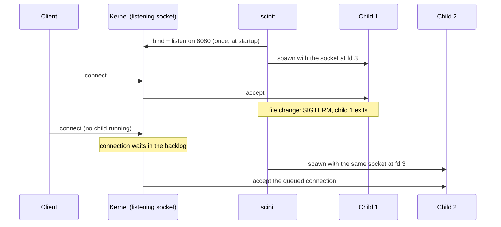

# Socket activation

A server normally opens its own listening socket: it calls `bind` and `listen` on startup and closes the socket when it exits. That is fine until you restart it. Between the old process closing the socket and the new one binding it again, nothing is listening on the port, and the kernel answers every connection attempt with a refusal. For a development loop with [live reload](live-reload.md), that gap opens every time you save a file, and it lasts as long as the shutdown, the restart delay and your app's startup combined.

scinit can close that gap by owning the sockets itself. With `--ports`, it binds the listening sockets before starting the child and passes them to it using the protocol systemd defined for socket activation. The sockets belong to scinit for its whole lifetime, so they stay open across restarts. A connection made while no child is running waits in the socket's backlog, the kernel's queue of connections not yet accepted, and the next child accepts it.



## The protocol

The systemd protocol is small, which is why many languages and frameworks already support it. The listening sockets are passed as open file descriptors starting at fd 3, right after stdin, stdout and stderr. Two environment variables describe them: `LISTEN_FDS` is the number of sockets, and `LISTEN_PID` is the process ID they are meant for. A program checks that `LISTEN_PID` equals its own pid before trusting the variables. The check exists because environment variables are inherited: if your app starts a subprocess, that subprocess sees the same `LISTEN_FDS` but should not treat its fds 3 and up as sockets.

scinit passes the sockets in `--ports` order, removing repeated ports, so the fd numbers are predictable:

| `--ports` | fd 3 | fd 4 | fd 5 | `LISTEN_FDS` |
|---|---|---|---|---|
| `8080` | 8080 | | | 1 |
| `8080,8443` | 8080 | 8443 | | 2 |
| `8080,8443,9090` | 8080 | 8443 | 9090 | 3 |
| `8080,8443,8080` | 8080 | 8443 | | 2 |

`LISTEN_PID` is the child's own pid, not scinit's. To get this right, scinit does the last step inside the child itself, after the fork and before running your program. There it moves the sockets to fds 3, 4 and so on with `dup2`, writes the child's pid into `LISTEN_PID`, and execs your command. Everything else scinit had open stays out of the child: the original sockets are close-on-exec, and so is every other inherited descriptor above stderr, so the child gets exactly stdin, stdout, stderr and the sockets.

If scinit was itself started with `LISTEN_*` variables, for example by a supervisor that uses socket activation, it removes them from the child's environment. They describe someone else's sockets, which the child doesn't have. This happens whether or not you pass `--ports`. Without `--ports`, the child gets no `LISTEN_*` variables at all.

## Worked example

The repository's test fixture, `scinit-test-child listen`, is a tiny server that adopts every inherited socket and answers each connection with its pid, the fd it accepted on and the port. It makes the mechanism easy to see. Here scinit binds two ports, with live reload on and a two-second restart delay so there is time to connect during the restart. All of this was run on macOS.

```console
$ SCINIT_LOG=info scinit --live-reload --watch-path config \
      --restart-delay-ms 2000 --ports 8080,8081 -- scinit-test-child listen
 INFO scinit: scinit starting
 INFO scinit: init system started, managing subprocess: scinit-test-child
 INFO scinit::file_watcher: Started watching path: "config"
 INFO scinit: File watching started for live-reload
 INFO scinit::process_manager: Spawning process: scinit-test-child ["listen"]
 INFO scinit::port_manager: Binding 2 ports to 127.0.0.1
 INFO scinit::port_manager: Bound port 8080 to 127.0.0.1:8080
 INFO scinit::port_manager: Bound port 8081 to 127.0.0.1:8081
 INFO scinit::port_manager: Successfully bound 2 ports
 INFO scinit::process_manager: Process spawned with PID: 95658
```

From another terminal, each port answers on the fd its position in `--ports` predicts:

```console
$ nc 127.0.0.1 8080
pid=95658 fd=3 port=8080
$ nc 127.0.0.1 8081
pid=95658 fd=4 port=8081
```

Now change the watched file and connect while the old child is gone and the new one hasn't started yet:

```console
$ echo v2 > config/app.conf
$ time nc 127.0.0.1 8080
pid=95666 fd=3 port=8080
real 1.31
```

The connection was not refused. It waited in the backlog for about a second and was answered by the new child, pid 95666, on the same fd. scinit's log shows that the restart reused the sockets instead of binding again (the long scratch directory path is shortened here):

```console
 INFO scinit: File changed: ".../config/app.conf", triggering restart
 INFO scinit::process_manager: Restarting process due to file change
 INFO scinit::process_manager: Initiating graceful shutdown of process 95658 with SIGTERM
 INFO scinit::process_manager: Process exited gracefully
 INFO scinit::process_manager: Spawning process: scinit-test-child ["listen"]
 INFO scinit::port_manager: Binding 2 ports to 127.0.0.1
 INFO scinit::port_manager: Successfully bound 2 ports
 INFO scinit::process_manager: Process spawned with PID: 95666
```

The fixture's `dump` mode shows what the child received. Here a duplicated port and a stale `LISTEN_FDNAMES` in scinit's own environment are both dropped. The fixture reports what it sees on stderr (and in the file named by `$SCINIT_TEST_REPORT`); only the relevant lines are shown, with the pid and timestamp fields shortened to `...`:

```console
$ LISTEN_FDNAMES=stale scinit --ports 8080,8443,8080 -- scinit-test-child dump --then-exit
env ... key=LISTEN_FDS value=2
env ... key=LISTEN_PID value=95696
fds ... open=0,1,2,3,4 sockets=3,4
```

The child, pid 95696, sees exactly two `LISTEN_*` variables and two sockets, at fds 3 and 4.

## Adopting the sockets in your app

Your app has to use the inherited socket instead of opening its own. Many frameworks and servers already support systemd socket activation, so check their documentation first. Otherwise it is a few lines. Each snippet below checks `LISTEN_PID`, then wraps fd 3 (and up, for more ports) as an already-listening socket. Don't call `bind` or `listen` on it again.

Python, where `socket.socket(fileno=...)` detects the family and type from the fd:

```python
import os, socket

def inherited_listeners():
    if os.environ.get("LISTEN_PID") != str(os.getpid()):
        return []
    count = int(os.environ.get("LISTEN_FDS", "0"))
    return [socket.socket(fileno=3 + i) for i in range(count)]
```

Go, with `net.FileListener`, which duplicates the fd, so the `*os.File` can be closed afterwards:

```go
func inheritedListeners() ([]net.Listener, error) {
	if os.Getenv("LISTEN_PID") != strconv.Itoa(os.Getpid()) {
		return nil, nil
	}
	count, err := strconv.Atoi(os.Getenv("LISTEN_FDS"))
	if err != nil {
		return nil, err
	}
	var listeners []net.Listener
	for fd := 3; fd < 3+count; fd++ {
		f := os.NewFile(uintptr(fd), fmt.Sprintf("listen-fd-%d", fd))
		l, err := net.FileListener(f)
		f.Close()
		if err != nil {
			return nil, err
		}
		listeners = append(listeners, l)
	}
	return listeners, nil
}
```

Rust, with the standard library:

```rust
use std::net::TcpListener;
use std::os::fd::FromRawFd;

fn inherited_listener() -> Option<TcpListener> {
    let ours = std::env::var("LISTEN_PID").ok()? == std::process::id().to_string();
    let count: i32 = std::env::var("LISTEN_FDS").ok()?.parse().ok()?;
    // Safety: the protocol says fd 3 is a listening socket we now own
    (ours && count >= 1).then(|| unsafe { TcpListener::from_raw_fd(3) })
}
```

or with the [`listenfd`](https://crates.io/crates/listenfd) crate, which reads the environment for you:

```rust
let mut listenfd = listenfd::ListenFd::from_env();
let listener = listenfd.take_tcp_listener(0)?; // Option<TcpListener> for fd 3
```

Node.js, where `listen` accepts an existing handle:

```js
const ours = process.env.LISTEN_PID === String(process.pid);
if (ours && Number(process.env.LISTEN_FDS) >= 1) {
  server.listen({ fd: 3 });
} else {
  server.listen(8080);
}
```

The fallback in the Node example is worth copying in any language: when the variables are absent, bind the port yourself, so the same app runs with or without scinit's `--ports`.

## Things to know

The default bind address is `127.0.0.1`, which only accepts connections from inside the container's own network namespace. Published ports (`docker run -p`) forward traffic to the container's external interface, so with the default, clients outside the container can't reach your app. In a quick test with rootless podman, `curl` against a published port got `Empty reply from server` with the default and reached the socket with `--bind-addr 0.0.0.0`. Other runtimes may report a refused or reset connection instead. In containers, use `--bind-addr 0.0.0.0`, or `::` for IPv6.

`--bind-addr` must be an IP address literal. Hostnames, including `localhost`, are rejected at startup:

```console
$ scinit --ports 8080 --bind-addr localhost -- true
ERROR scinit: Invalid bind address 'localhost': invalid IP address syntax
```

For IPv6, pass the bare address, such as `::` or `::1`, without brackets. scinit doesn't set `IPV6_V6ONLY`, so whether a socket bound to `::` also accepts IPv4 connections follows the operating system's default. On macOS, and on Linux with the usual `net.ipv6.bindv6only=0`, it does: in our test on macOS, a socket bound to `::` answered both `::1` and `127.0.0.1`. There is one bind address for all ports.

The sockets are TCP only, with a backlog of 128. The backlog bounds how many connections can wait while no child is running; the kernel may also cap it lower (for example with `net.core.somaxconn` on Linux). Connections beyond it are not queued. `SO_REUSEADDR` is always set, so scinit can bind again right after a previous scinit exited, while old connections are still in `TIME_WAIT`. `SO_REUSEPORT` is only set with `--reuse-port`. Restarts don't need it, since they reuse the same socket. It is for letting another process that also sets `SO_REUSEPORT` bind the same port alongside scinit.

Ports are bound when the first child is spawned. If a port is taken, scinit exits with code 1 before starting your app. The error comes straight from the operating system and doesn't name the port (48 is macOS's error number; Linux reports 98):

```console
$ scinit --ports 8080 -- my-server
ERROR scinit: Address already in use (os error 48)
```

The same collision happens if your app ignores the inherited socket and binds the port itself, because scinit is already holding it.

scinit does not set `LISTEN_FDNAMES`, so the sockets can only be told apart by their order. Libraries that look sockets up by name won't find them.

Socket activation doesn't depend on live reload. Without `--live-reload` the child still gets its sockets, and there is only ever one child.

## Related

[Getting started](../getting-started.md) has a first run, and the [CLI reference](../reference/cli.md) lists `--ports`, `--bind-addr` and `--reuse-port` with their defaults. [Live reload](live-reload.md) is the feature this one is usually paired with, and [process isolation](process-isolation.md) explains which other file descriptors the child does and doesn't get. [Logging](logging.md) shows how to see what scinit bound. See also [why an init](why-an-init.md), [signals and shutdown](signals-and-shutdown.md), [exit codes](exit-codes.md) and [zombie reaping](zombie-reaping.md).
