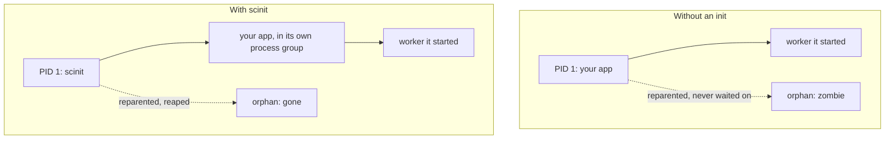

# Why a container needs an init

A container's main process runs as PID 1 inside its own PID namespace. On a normal machine that slot belongs to an init system such as systemd, and the kernel treats it differently from every other process. Most applications were never written to be PID 1, and when they end up there, three things go wrong quietly: the container ignores `docker stop`, orphaned processes pile up as zombies, and the exit status that orchestrators rely on can be lost or wrong. scinit exists to sit in that slot, do the init's job, and run your application as an ordinary child.

This guide explains each of the three problems, shows them happening in a real container, and then describes where scinit fits next to tini, dumb-init and `docker run --init`.

The examples use a small image called `scinit-demo`: Debian with `procps` (for `ps`) and a Linux build of scinit copied in. If you want to follow along, build it next to a `scinit` binary built for Linux:

```dockerfile
FROM debian:trixie-slim
RUN apt-get update && apt-get install -y --no-install-recommends procps \
    && rm -rf /var/lib/apt/lists/*
COPY scinit /usr/local/bin/
```

The commands use podman; Docker behaves the same way.



## Problem 1: PID 1 ignores signals it doesn't handle

Every signal has a default action. For SIGTERM and SIGINT that action is to terminate the process, which is why an ordinary program that never thinks about signals still dies when you press Ctrl-C or run `kill`. The kernel makes one exception: it does not apply default actions to the init of a PID namespace. A signal sent to PID 1 is delivered only if PID 1 has installed a handler for it (or has it blocked, waiting to collect it). Otherwise the kernel discards it. The only signals that get through regardless are SIGKILL and SIGSTOP, and only when they come from outside the namespace. This protects the system from an init being killed by accident, but inside a container it means that an application that relies on the default action of SIGTERM simply never sees it.

`docker stop` sends SIGTERM, waits for a timeout (10 seconds by default), then sends SIGKILL. When PID 1 ignores the SIGTERM, every stop takes the full timeout and ends in a kill, so the application never gets a chance to finish requests, flush buffers or close connections. Here is `sleep`, which installs no handlers, running as PID 1:

```console
$ podman run -d --name noinit scinit-demo sleep infinity
$ time podman stop noinit        # took 10s
$ podman inspect -f '{{.State.ExitCode}}' noinit
137
```

The stop took ten seconds and the exit code is 137, which is 128 + 9: the container was killed with SIGKILL. The same command under scinit:

```console
$ podman run -d --name withinit scinit-demo scinit -- sleep infinity
$ time podman stop withinit      # took 0s
$ podman inspect -f '{{.State.ExitCode}}' withinit
143
```

scinit received the SIGTERM, forwarded it to `sleep`, which is not PID 1 and so dies from the default action, and then exited with 143 (128 + 15), reporting that the application was terminated by SIGTERM. [Getting started](../getting-started.md#watch-a-graceful-shutdown) shows the same stop with scinit's log turned on, and the [signals and shutdown guide](signals-and-shutdown.md) covers how scinit receives and forwards signals, and what happens when the child doesn't exit in time.

## Problem 2: orphans become zombies

When a process exits, the kernel keeps a small entry for it in the process table until its parent collects the exit status with one of the `wait` calls. Until then the process is a zombie: it uses no memory or CPU, but it holds a PID. If a process's parent exits first, the orphan is reparented to the nearest ancestor marked as a subreaper, or to PID 1 of its namespace. In a container that is usually PID 1, so PID 1 inherits the job of waiting for processes it never started.

Applications don't expect this. A web server doesn't call `wait` for children it doesn't know about, so orphans that land on it stay zombies until the container stops. A few zombies are harmless, but a process that keeps spawning short-lived helpers (shell scripts that background commands, health checks that fork, language runtimes that double-fork) can leak them steadily until the container hits its PID limit and can no longer fork.

You can see this with a shell that backgrounds a short `sleep` from a subshell, which orphans it, then replaces itself with a long-running `sleep` as PID 1:

```console
$ podman run -d --name z1 scinit-demo sh -c '(sleep 1 &); exec sleep infinity'
$ podman exec z1 ps -eo pid,ppid,stat,comm
    PID    PPID STAT COMMAND
      1       0 Ss   sleep
      3       1 Z    sleep
      4       0 Rs   ps
```

Process 3 is the orphaned `sleep 1`. It exited, was reparented to PID 1, and stays in state `Z` because PID 1 never waits for it. Run the same command under scinit and the orphan is reaped as soon as it exits; the [zombie reaping guide](zombie-reaping.md#seeing-it-work) shows that run, and explains when scinit reaps and how it avoids stealing the exit status of the application itself.

## Problem 3: the exit status has to survive

Orchestrators read the container's exit status to decide what happened. Kubernetes records it in the pod status and uses it for restart policies and Job completion; Docker shows it in `docker ps -a` and uses it for `--restart on-failure`. The container's exit status is PID 1's exit status, so an init that sits between the runtime and your application must pass the application's status through unchanged. If it always exited 0, a crash would look like a clean shutdown; if it always exited 1, a clean shutdown would look like a failure.

scinit exits with the child's exit code, or with 128 plus the signal number if the child was killed by a signal, the same convention shells use. The [exit codes guide](exit-codes.md) lists every case, including the exit codes scinit uses for its own errors.

## Where scinit fits

Running an init as PID 1 is a well-established practice, and scinit is not the first tool for it. [tini](https://github.com/krallin/tini) is the most widely used; Docker ships it as `docker-init` and runs it when you pass `docker run --init`. [dumb-init](https://github.com/Yelp/dumb-init) solves the same problems with a different emphasis on process groups and signal rewriting. Podman's `--init` uses catatonit. All of them forward signals, reap zombies and pass the exit status through, and if that is all you need, any of them will serve you well.

scinit covers the same ground, and then adds two features designed for [remote development environments](remote-development.md). With `--live-reload` it watches a file or directory and restarts the child when it changes, so it can run the service in a development container or pod where a new build can be written into the container, for example by a sidecar that recompiles synchronized sources. With `--ports` it binds listening sockets itself and hands them to every child it starts using the systemd socket-activation protocol, so connections queue in the kernel's backlog during a restart instead of being refused. The two work together: a rebuilt server is restarted without dropping a request. See [live reload](live-reload.md) and [socket activation](socket-activation.md) for the details.

Beyond that, scinit takes care of a few things about the environment the child starts in: its own process group, an empty signal mask, the terminal's foreground, and no stray file descriptors. The [process isolation guide](process-isolation.md) describes them.

## Things to know

scinit only takes on the init's duties when it actually is PID 1. It doesn't register itself as a child subreaper, so if something else is PID 1 (for example because you also passed `docker run --init`, or because you run scinit outside a container), orphans are reparented to that process, not to scinit. Running two inits is harmless but pointless; pick one.

The kernel's protection of PID 1 also applies to scinit. scinit installs handling for the signals it cares about (SIGTERM, SIGINT, SIGQUIT, SIGUSR1, SIGUSR2 and SIGHUP), so those arrive. Signals outside that set, such as SIGWINCH or SIGTSTP, are not forwarded to the child. They take their default action on scinit itself, which, when scinit is PID 1, means the kernel discards them.

When PID 1 exits, the kernel kills every other process in the container's PID namespace. That is why scinit exiting with the child, rather than staying around, is the right behavior in a container: whatever the child left behind is cleaned up with it.

## Related

[Getting started](../getting-started.md) shows how to put scinit in a Dockerfile. [Signals and shutdown](signals-and-shutdown.md), [exit codes](exit-codes.md), [zombie reaping](zombie-reaping.md) and [process isolation](process-isolation.md) go deeper on each duty described here, and the [CLI reference](../reference/cli.md) lists every flag.
