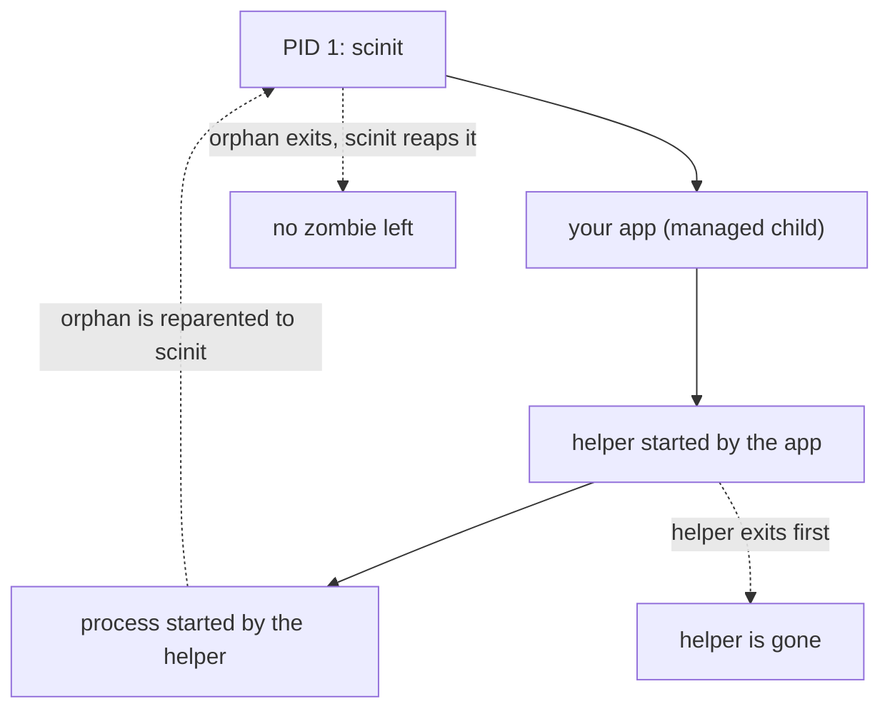

# Zombie reaping

When a process exits, it doesn't disappear right away. The kernel keeps a small record of it, holding its PID and exit status, until its parent asks for that status with one of the `wait` system calls. Between exiting and being waited for, the process is a zombie, shown as `Z` or `<defunct>` in `ps`. Collecting the status is called reaping.

Normally the parent reaps its own children. The trouble starts when a parent exits before its child: the child becomes an orphan and is reparented, usually to PID 1. In a container, PID 1 is whatever the image's entrypoint runs, and an application that never expected to adopt other processes won't reap them. Each one stays a zombie until the container stops, holding a PID. Containers often run with a PID limit, and a steady trickle of zombies from shell scripts, health checks or helper processes can eventually exhaust it, at which point nothing in the container can fork.

When scinit is PID 1, orphans are reparented to scinit, and it reaps them. On Linux this also holds when scinit is not PID 1, because scinit registers itself as a child subreaper (see [Things to know](#things-to-know)).



## When scinit reaps

scinit runs a reaping pass at three moments. The main one is SIGCHLD: the kernel sends it to a parent whenever one of its children exits, so an orphan is usually reaped within moments of exiting. As a fallback, scinit also runs a periodic pass every `--zombie-reap-interval-ms` milliseconds (5000 by default), which catches anything a missed or coalesced SIGCHLD left behind. Finally, scinit runs one last pass right before exiting, whether the child exited on its own or scinit stopped it after a termination signal, so a container doesn't leave zombies behind it.

The SIGCHLD and periodic passes run on a background thread so they never hold up the main loop, which may be busy forwarding a signal or restarting the child. The final pass runs inline, because scinit's runtime shuts down immediately afterwards and a background task might never get to run.

## Leaving the managed child alone

There is one child scinit must not reap in these passes: the application it started. scinit waits for that child separately, because the child's exit status becomes scinit's own exit code (see [exit codes](exit-codes.md)). If the reaper collected the child first, that status would be gone, and the wait would fail with "no child processes".

The reaper avoids this by looking before it takes. For each exited child, it first asks the kernel which process it is without consuming the status (`waitid` with `WNOWAIT`, which leaves the zombie in place). If it is the managed child, the pass stops and leaves it for scinit's own wait, which collects it promptly. Otherwise it reaps that PID and moves on to the next one. Any other zombies that were waiting behind the managed child are picked up by the next pass, or by the final pass at exit.

## Seeing it work

These examples run in a Linux container (the `scinit-demo` image is described in [why an init](why-an-init.md)). The child is a shell that starts `sleep 1` in a subshell that exits immediately, which orphans the `sleep`, and then replaces itself with a long-running `sleep`. First without scinit, so that the orphan's new parent is a PID 1 that never waits:

```console
$ podman run -d --name z1 scinit-demo sh -c '(sleep 1 &); exec sleep infinity'
$ podman exec z1 ps -eo pid,ppid,stat,comm
    PID    PPID STAT COMMAND
      1       0 Ss   sleep
      3       1 Z    sleep
      4       0 Rs   ps
```

The orphan, PID 3, exited and is stuck as a zombie under PID 1. With scinit as PID 1, and debug logging turned on for the reaper:

```console
$ podman run -d --name z2 -e SCINIT_LOG=scinit::reaper=debug scinit-demo \
    scinit -- sh -c '(sleep 1 &); exec sleep infinity'
$ podman logs z2
DEBUG scinit::reaper: reaped zombie process 12 with exit status 0
DEBUG scinit::reaper: reaped 1 zombie processes
$ podman exec z2 ps -eo pid,ppid,stat,comm
    PID    PPID STAT COMMAND
      1       0 Ssl  scinit
      9       1 S    sleep
     13       0 Rs   ps
```

The orphan was reparented to scinit, reaped as soon as it exited, and is gone from the process table.

## Things to know

On Linux, scinit marks itself a child subreaper (`PR_SET_CHILD_SUBREAPER`) at startup, before it starts the child. The kernel reparents an orphan to its nearest living ancestor that is a subreaper, and only to PID 1 when there is none, so orphans of the child come to scinit even when something else is PID 1: under the runtime's own init (`docker run --init`), in a Kubernetes pod with `shareProcessNamespace: true`, where the pause container is PID 1, or when scinit runs outside a container. The reaping passes above, including the final one, then cover those orphans too. If the kernel refuses the call, scinit logs a warning and continues, and orphans go to PID 1 as they would without it. The flag is not inherited by the child.

macOS has no equivalent, so there scinit only receives orphans when it is PID 1. Outside a container, which is how scinit runs on macOS, orphans go to launchd, which reaps them.

Being a subreaper only changes where orphans go while scinit is running. scinit doesn't wait for live orphans before exiting. In a container where scinit is PID 1 the kernel kills them when it exits; otherwise they are reparented again, to PID 1 or the next subreaper above scinit, and keep running.

Making scinit the container's entrypoint (`ENTRYPOINT ["scinit", "--"]`) is still the recommended setup, since signal handling and the container's exit code depend on scinit being PID 1 (see [why an init](why-an-init.md)). Also enabling the runtime's init is harmless but adds nothing.

Lowering `--zombie-reap-interval-ms` is rarely useful, since SIGCHLD already triggers a pass whenever a child exits; the periodic pass is only a safety net. The value must be at least 1.

A process that is still running is never touched. Reaping only applies to processes that have already exited, so scinit never kills or waits on a live orphan. Live processes left in the container when scinit exits are killed by the kernel, as described in [why an init](why-an-init.md).

## Related

[Getting started](../getting-started.md) shows how to make scinit the entrypoint. The [CLI reference](../reference/cli.md) documents `--zombie-reap-interval-ms`. [Signals and shutdown](signals-and-shutdown.md) explains how scinit uses SIGCHLD alongside the signals it forwards, [exit codes](exit-codes.md) covers the managed child's status, and [logging](logging.md) describes `SCINIT_LOG`, used above to watch the reaper.
